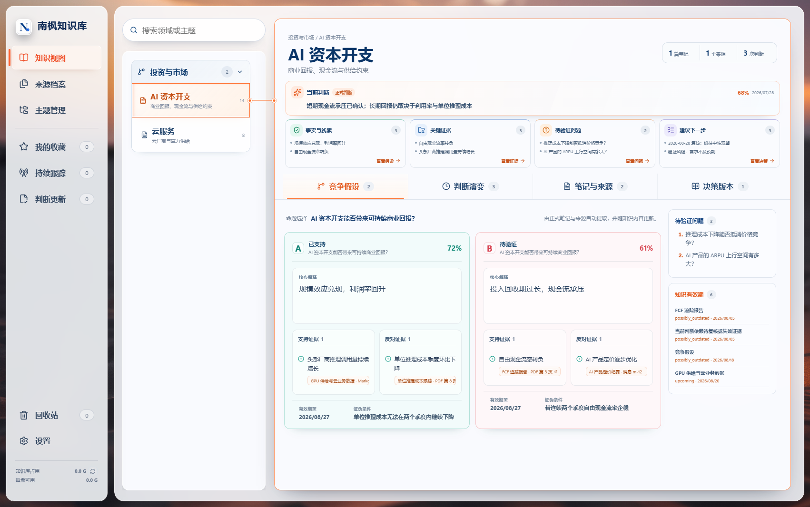

# 南枫知识库（Nanfeng Knowledge Base）

本地优先的 Windows 知识整理与判断版本库。软件使用 Tauri 2、React/TypeScript、Rust 和 SQLite/FTS5，笔记、来源文件、主题结构、判断版本与备份均保存在本机。

当前版本：**v0.4.0**



## 核心能力

- **主题洞察**：把笔记整理为竞争假设、判断演变、主题整合与决策版本，并自动生成事实、证据、待验证问题与建议行动。
- **全部笔记**：统一查看导入内容，支持搜索、筛选、紧凑卡片、来源重命名、持久删除与原始正文回溯。
- **主题管理**：维护领域与主题结构，知识、来源和主题共用同一套数据与筛选规则。
- **AI 自动整理**：可选用 OpenRouter 或 DeepSeek 直连；OpenAI、Claude 与 DeepSeek 模型可通过 OpenRouter 使用。支持单主题或一键整理全部主题、实时进度、失败主题重试，以及逐任务 Token 与金额统计。
- **自动整理**：导入后自动识别主题、状态和来源；按内容指纹准确去重，来源重复时复用既有笔记。
- **文件与附件**：支持 ChatGPT 导出 ZIP、JSON、Markdown、TXT、HTML 等批量导入；图片和附件可在软件内预览，图片使用原始文件渲染并支持缩放、拖动与复位。
- **检索与版本**：FTS5 中文检索、短关键词回退、命中高亮、判断自动保存、追加版本和恢复为新版本。
- **数据安全**：回收站、SQLite 一致性检查、完整备份与恢复、导入原件归档；恢复前自动生成安全备份。
- **统一外观**：四套浅色玻璃皮肤共享同一布局和交互规则，小窗口下优先保障主要内容空间。

浏览器运行使用本地演示适配器，仅用于界面开发；正式桌面数据只由 Rust/SQLite 链路持有。

## 下载与安装

在 [GitHub Releases](../../releases) 下载当前 Windows x64 安装包。安装包尚未进行商业代码签名，Windows 可能显示 SmartScreen 提示，请先核对 Release 中的 SHA-256。

## 数据位置

- 默认数据根目录：`D:\南枫知识库`。
- 数据库位于 `D:\南枫知识库\data\app.db`；原始导入文件、附件、导出、备份和日志位于同级受控目录。
- 首次运行会在目标目录为空时只读复制可识别的旧版数据；原目录保留，不删除、不覆盖。
- D 盘不可用时继续使用 AppData 目录，避免迁移失败阻断启动。

## 本地验收

双击根目录的 `启动南枫知识库-当前验收.bat` 可启动当前验收程序，不安装系统组件，也不会生成安装包。需要生成当前隔离验收程序时运行：

```powershell
.\启动南枫知识库-当前验收.bat --prepare
```

每项用户可见改动还配有对应的中文双击验收 BAT；Codex 自动验证只使用隔离数据，不读写正式知识库。

## 开发与验证

```powershell
npm install
npm run typecheck
npm test
npm run build
npm run test:sites
cargo test --manifest-path src-tauri/Cargo.toml
```

启动桌面开发环境：

```powershell
npm run tauri:dev
```

## 文档入口

- [产品边界](docs/product-brief.md)
- [架构所有权](docs/architecture-governance.md)
- [核心工作区设计基线](docs/core-workspace-design-baseline.md)
- [验收矩阵](docs/core-workspace-acceptance-matrix.md)
- [当前交接](docs/CURRENT_HANDOFF.md)
- [视觉 QA](design-qa.md)

## 当前边界

- 不依赖云数据库或遥测服务；AI 模型 API 为用户主动配置的可选增强，未配置时本地知识整理与阅读仍可使用。
- 浏览器适配器不读写真实文件；文件系统、导入、导出和备份仅在 Tauri 桌面端启用。
- 当前版本不提供多端同步；移动端适配属于后续独立交付范围。
