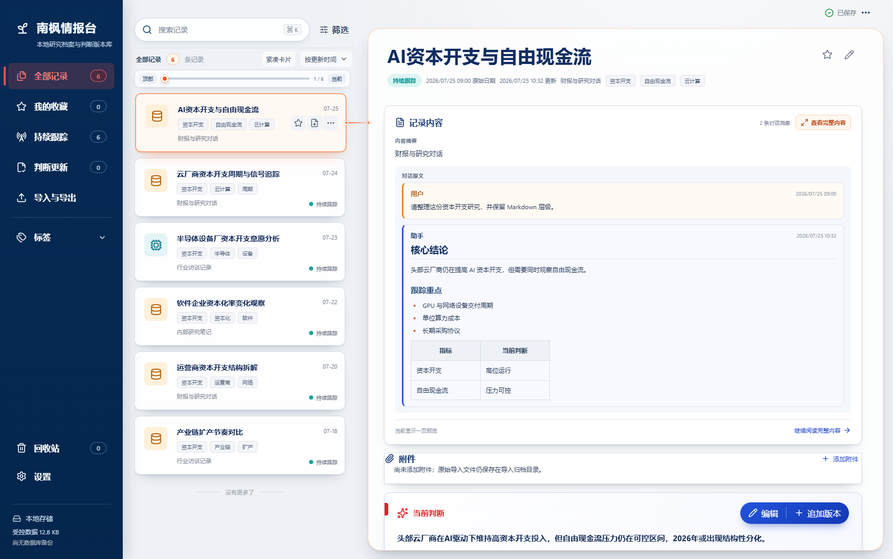

# 南枫情报台（Nanfeng Intelligence）

本地优先的 Windows 研究档案与判断版本库。桌面端使用 Tauri 2、React/TypeScript、Rust、SQLite/FTS5；核心记录、来源、原始文件、版本与备份均保存在本机。



## 已实现

- 记录全字段新建、编辑、复制、收藏、状态和标签管理；侧栏“我的收藏”集中查看已收藏笔记。
- 当前判断自动保存；版本追加、只读预览和“恢复为新版本”。
- 回收站恢复；永久删除仅在回收站内进行一次明确确认。
- 中文搜索：FTS5 trigram，1–2 字关键词回退到 LIKE；筛选、排序和命中高亮。
- JSON、Markdown、TXT、HTML 支持多选和批量拖拽队列；原文件逐个归档，再计算 SHA-256、预览、映射、查重和写入导入日志，单个失败不会中断整批；Claude 与 ChatGPT 会话由软件自动整理为可读角色对话。
- 单篇完整 Markdown/DOCX、单条 Markdown/JSON、全量 JSON 与 Obsidian Vault 导出。
- SQLite 一致性备份；另有包含数据库、历史版本、回收站、附件、导入原件和界面偏好的完整迁移备份，恢复前自动安全备份并校验恢复结果。
- 深色单侧栏、冷灰工作区、白色卡片、底部阴影、克制动效和低调关联线。

浏览器运行使用本地演示适配器，便于 UI 调试；正式桌面数据只由 Rust/SQLite 链路持有。

## 数据位置

- Windows 默认数据根目录：`D:\南枫情报台`。
- 首次使用新版且目标目录为空时，会把旧版 AppData 数据完整复制到 D 盘；旧目录保留，不做删除。
- 数据库位于 `D:\南枫情报台\data\app.db`，原始导入文件、附件、导出、备份和日志分别位于同级受控子目录。
- 如果 D 盘不可用，程序会继续使用原 AppData 目录，避免因迁移失败阻断启动。

## BAT 测试入口

先双击根目录的 `启动南枫情报台-测试版.bat`。它会直接启动本地测试程序，不安装系统组件，也不会生成安装包。
若检测到旧版仍在运行，BAT 会要求先关闭旧窗口，避免两个进程同时读写数据库。

当测试程序不存在或需要强制更新时，可在项目目录运行：

```powershell
.\启动南枫情报台-测试版.bat --rebuild
```

`--rebuild` 只执行 Tauri `--no-bundle` 构建，不生成安装器。

## 本地开发

```powershell
npm install
npm run tauri:dev
```

只检查浏览器界面：

```powershell
npm run dev -- --port 4173
```

## 验证与打包

```powershell
npm run typecheck
npm test
npm run build
npm run test:sites
cargo test --manifest-path src-tauri/Cargo.toml
```

仅在 BAT 版本测试通过并获得明确确认后，再生成 Windows x64 安装包。

## 文档入口

- [产品边界](docs/product-brief.md)
- [架构所有权](docs/architecture-governance.md)
- [依赖说明](docs/DEPENDENCIES.md)
- [设计系统](docs/design-system.md)
- [当前交接](docs/CURRENT_HANDOFF.md)
- [视觉 QA](design-qa.md)

## 当前边界

- 不依赖云数据库、模型 API 或遥测服务。
- 浏览器适配器不读写真实文件；文件系统、导入、导出和备份能力仅在 Tauri 桌面端启用。
- 当前版本不实现行动项完成状态、系统通知或多端同步；界面不展示这些未落地入口。
