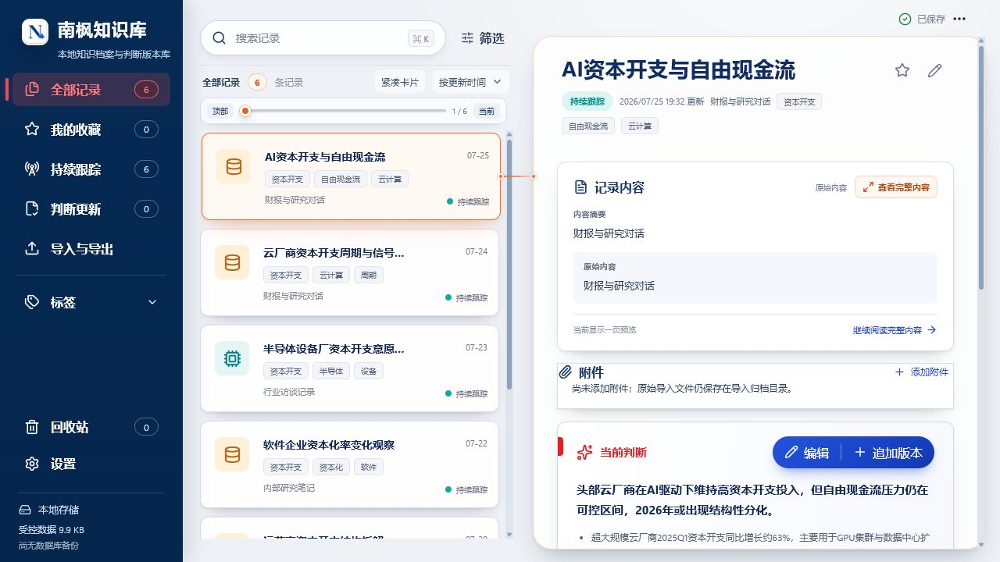
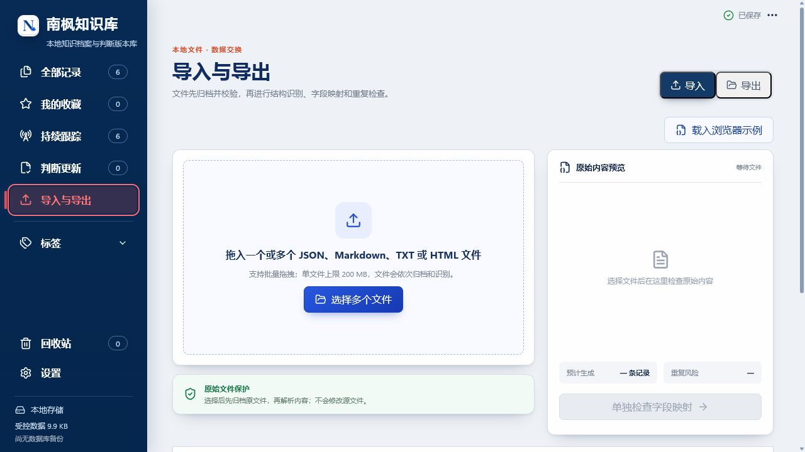

# 主规格对齐产品审计

## 审计结论

当前应用的视觉完成度、本地数据链路和长内容阅读基础较好，但核心任务仍是“打开一条记录并查看详情”。主规格要求的是“来源进入收录箱，经解释和确认形成长期主题，再推动判断、证据和问题演化”。两者不是增加几个菜单的差距，而是对象模型、入口和用户闭环的差距。

整体健康度：

- 视觉与桌面基础：良好；
- 原件保护、导入、阅读、导出、备份：良好；
- 主题层级、可解释分类、结构治理：缺失；
- 判断演化与上下文复用：部分基础可复用，领域闭环缺失；
- 当前结论：适合原型重构，不适合直接迁移数据库。

## 流程 1：现有记录工作台

观察：

- 三栏阅读结构清楚，卡片层级、选中反馈、详情阅读和历史信息成熟。
- 当前判断、证据、问题、版本已形成可复用的信息组件。
- 主入口仍是扁平“全部记录”，用户先找文件/标题，而不是进入长期主题。
- 一条 `Record` 同时呈现来源、正文、判断、证据和问题，产品对象边界不清。
- 标签承担导航与分类，但不能表达唯一主路径、别名、重定向、关系和结构操作。

## 流程 2：现有导入与导出

观察：

- 批量拖拽、原件保护、预览、导出和备份属于可靠基础设施。
- 导入完成后的目标是“生成记录”，缺少统一收录箱、分类建议、解释和确认环节。
- 导入/解析/归类的产品状态没有在第一屏形成可理解的管线。
- 后续必须固定顺序：原件归档 → 提取 → 标准化 → 分类建议 → 人工确认。

## 流程 3：收录箱与可解释分类原型

改进点：

- 新来源统一进入收录箱，四种来源使用不同图标和元数据。
- 第一屏同时显示主题树、待处理队列和分类解释，避免跳转丢失上下文。
- 建议包含主路径、置信度、五层分数、原因、候选和相似来源。
- 高置信批量接受被限制在 `≥90%`；接受后可立即撤销。
- 底部管线明确分类发生在提取和标准化之后。

## 流程 4：主题知识页原型

改进点：

- 浏览单位从“单篇记录”切换为“长期主题”。
- 当前判断、证据、问题、关系和来源都以主题为中心。
- 判断时间线单独呈现变化，不把普通更新时间伪装为转折。
- 研究上下文由本地对象编译，可选择内容范围，不依赖模型摘要。

## 流程 5：结构治理原型

改进点：

- 合并、拆分、相似和操作日志在同一治理入口处理。
- 合并必须预览主主题、别名、来源、判断、证据、重定向和快照影响。
- 拆分首版只给方案，不提供一键执行。
- 最近操作保留撤销和查看入口，避免自动动作不可追溯。

## 设计判断

- 保留现有深色单侧栏、冷灰画布、白色卡片、深蓝正文和受控语义色。
- 列表选择继续用明亮橙色；侧栏选择继续使用红色语义，不用大面积蓝色或装饰渐变。
- 新增颜色只表达语义：绿为证据/安全，橙为待验证/建议，紫为横向关系，蓝为结构和主操作。
- 首页不做 BI 指标墙；只有可行动的收录箱、最近演化和到期问题才有价值。

## 证据边界

- 本审计基于当前浏览器演示、代码与用户提供的主规格。
- 原型交互已在浏览器验证，但所有内容均为假数据。
- 未验证新领域模型、真实分类准确率、数据库迁移或正式数据性能。
- GitHub 项目只用于产品模式参考，没有复制其代码或架构。
