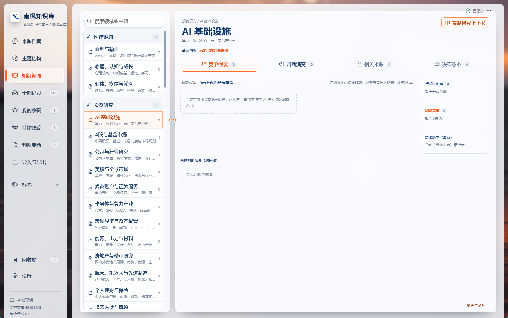
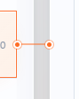

# 南枫知识库核心工作区设计基线

状态：`LOCKED`

确认日期：2026-07-29

本文件把南烛枫在会话中确认的最终页面图转成可执行合同。它锁定的是核心产品组织、页面功能布局和交互状态；五套皮肤是另一个独立视觉合同。除非南烛枫明确提出新方向，后续开发必须同时继承二者。

## 0.3 暗色黑色材质合同（2026-08-13）

- 暗色模式不是五套皮肤各自复制一套页面颜色。五套皮肤只提供强调色；所有中性表面、边线、文字、图标、输入和Portal统一从唯一黑色材质总线取值：`panel=#101415 / raised=#171d1e / input=#0c1011 / border=#050707 / primary=#f5fbf8 / secondary=#c2d0ca`。
- 搜索及正文搜索的输入本体必须透明且使用亮色文字，背景只由外层搜索控件提供；不得出现文字背后的黑色独立矩形、白色内层或浏览器默认选区样式。实际选择文本时才显示强调色选区。
- 暗色下所有普通按钮、图标底板、回收站条目、附件、等待态、来源消息、Markdown表格/引用/代码块、标签、列表卡、弹窗与弹窗内层都使用不透明黑色实体面和黑色边线；危险操作允许深红语义面，但不得使用白底。白色玻璃边框和浅色控件仅属于亮色模式。
- 暗色模式不改变页面结构、功能位置、几何、滚动、点击范围或交互职责。场景皮肤可保留外层背景与玻璃，但内部业务控件必须服从黑色材质总线；实体皮肤同样服从该总线。

现行名称固定为`主题洞察 / 全部笔记 / 主题管理`。参考资产文件名和历史记录中保留的`knowledge-view / source-archive / 知识视图 / 来源档案`只用于证据定位，不取得用户可见名称或新实现的所有权。同一类别内若规则冲突，以本文件中日期更晚且明确写明“替代”的规则为准；失败参考只锁定问题，不能反向成为设计基线。

## 0. 需求来源与推导顺序

四张页面图不是脱离产品逻辑的视觉稿，也不能只按像素或旧页面局部复刻。实现必须按以下顺序理解：

1. `docs/南枫知识库_产品定义与自动分类主规格.md` 是最高产品定义，规定本地优先、自动分类、主题框架、跨时期整合、证据、判断演化和上下文复用。
2. 南烛枫于 2026-07-29 重新明确：旧收录箱并入当前`全部笔记`，旧主题浏览器与整理工作台并入当前`主题管理`；人工分类不能成为主要使用路径；核心必须增加命题层、竞争假设、知识有效期和决策账本，并以良好层次直接展示长期知识成果。
3. 本轮重新提供的 `新建 文本文档.txt` 强化核心链路：`来源资料 → 主题 → 命题 → 竞争假设 → 支持/反对证据 → 当前判断 → 逻辑失效条件 → 决策和行动 → 结果 → 复盘`。其中命题层、证据锚点和决策结果记录是界面组织必须能够承载的对象，不是装饰性卡片文案。
4. 本文件的四张图负责把上述产品要求落为桌面工作区的页面组织、模块主次和交互状态；图片不能反向把软件简化成静态看板，也不能被旧 CRUD 页面结构包裹。
5. `src/theme/knowledgeSkins.ts` 和现行五套皮肤合同只负责同一组织框架的视觉呈现，不得产生另一套导航、栏位宽度、模块层级或交互结果。

### 0.1 从需求到三个入口

| 入口 | 日常用户任务 | 自动化优先结果 | 人工操作边界 | 核心对象 |
|---|---|---|---|---|
| 全部笔记 | 阅读已导入来源及其整理结果 | 自动归入领域/主题、关联命题、给出置信度和依据 | 仅低置信、冲突、无合适主题时调整归属 | Source Item、Classification Suggestion、Evidence Anchor |
| 主题管理 | 查看和维护长期分类框架 | 自动归类依据、相似主题、结构建议和明确待处理事项 | 新建、编辑、合并、拆分预览与关系调整均为次级维护 | Domain、Topic、Alias、Relation、Structural Operation |
| 主题洞察 | 直接阅读跨时期形成的知识与判断 | 汇总命题、竞争假设、证据、有效期、判断演变和决策结果 | 新证据、判断和决策的维护从成果阅读进入，不以大表单开场 | Proposition、Evidence、Judgment Snapshot、Open Question、Decision |

### 0.2 统一工作区框架

- 所有页面入口、所有五套皮肤使用同一个主导航组件、入口分组和交互结果，不能出现重复导航或另一套入口体系。
- 三个核心入口切换时，左侧主导航的分组、顺序、选中反馈和底部状态区保持稳定；同一皮肤内的宽度与位置不得随页面变化。
- 四张图中的左侧深蓝配色只属于`原版浅色`视觉，不是另外三套场景皮肤的皮肤来源。四张图约束左侧入口组织和层级；场景皮肤继续沿用已确认版本的背景、四周留白、圆角冷白磨砂侧栏和圆角主面板。
- 场景皮肤的外层留白、圆角和玻璃材质属于视觉外框，不得被误判为新的产品结构；其内部三入口、对象层级、默认状态和交互结果必须与`原版浅色`一致。
- 场景皮肤的核心工作区必须先铺一层完整、半透明、冷白磨砂底，再在其上放置树、列表、正文和语义卡；不能只给局部卡片磨砂而让场景背景直接进入大面积内容区。
- 全部笔记卡片二的搜索、组合筛选、显示工具栏、整理状态与定位条，直接复用`我的收藏`的非滚动控制区结构；只有下方笔记列表可以滚动。控制区不得再嵌入滚动容器，不使用`sticky`、向下延伸的伪元素遮罩、负右边距或私有滚动条覆盖层。全部笔记只保留自身的`全部 / 待确认 / 已归类 / 全部加载`业务筛选和搜索结果，不另建视觉外壳。外层`UnifiedNoteListPanel`唯一持有14px圆角和裁切，列表从定位条下方开始，滚动内容不得进入控制区背后。这条规则替代v66-v70的固定磨砂遮蔽方案；旧截图和52px遮罩仅作为失败证据。
- 中栏和右侧详情是核心工作区的共享组织方式：中栏负责定位对象，右侧负责阅读成果；不是在旧页面容器里再嵌套一套新页面。
- 辅助入口不得与三个核心入口同级争夺首屏，也不得恢复旧收录箱、旧主题浏览器或旧整理工作台。
- 辅助导航只保留`我的收藏 / 持续跟踪`；`判断更新`不再作为人工入口。底层`updated`状态仅为历史兼容与筛选语义，不得重新生成侧栏页面。
- 手工标签不再作为独立导航或人工维护中心；批量导入导出统一进入`设置 → 数据与存储`。
- `设置 → 数据与存储`固定分为三层：`数据交换`只负责批量导入与内容导出；`备份与恢复`在同一区域成对提供完整备份创建与恢复；`高级维护`默认折叠，只承载打开数据目录、数据库完整性检查、搜索索引重建和明确标注“不含附件/导入原件/界面设置”的数据库快照。完整备份不得再在数据交换导出页重复出现。
- 批量导入导出页返回动作统一称为`返回上一级`，并直接回到已打开的`设置 → 数据与存储`弹窗，不得只回设置首页。数据与存储弹窗在1702×1066标准视口默认约1040×760，使用独立尺寸身份并支持右下角人工调节；数据交换为较小的次级操作区，备份创建/恢复在独立大区内成对排列，备份范围使用单行说明，高级维护继续默认折叠。问题参考为`data-exchange-return-parent-reference.png`（SHA-256=`16427445A2AA7B7E7917EA8CD6C40B204EC539B88B1A7248644FF8DAEEF4A1B5`）与`settings-data-storage-small-crowded-reference.png`（SHA-256=`539216D0D3394DD4A3420E64A51EE0BCFE4278B571B1D1F9BF6EC26D34BB23A9`）；它们锁定B页面功能布局和C交互问题，不锁定旧尺寸、拥挤排版或示例容量数据。
- 2026-08-01后续反馈替代上一条中“数据交换较小、备份区较大、备份范围单行说明”的局部布局：`数据交换 / 备份与恢复`固定为等宽等高双卡，每张卡只保留一个标题、一句提示和贴底操作区；不得再显示`批量导入与导出 / 完整备份适合换机与灾难恢复 / 备份范围`等重复说明。存储统计由App唯一刷新入口持有，窗口重新获得焦点时自动扫描，主界面容量区与设置概览共用刷新图标并同步结果；外部删除文件后不得继续依赖启动时旧缓存。
- 2026-08-10设置页主卡片统一使用同一900px内容列和左右起点；外观与皮肤、当前程序、AI自动整理、数据与存储、快捷键不得各自扩展成不同宽度。`当前程序`只提供版本与校验信息，固定放在全部可操作设置之后的页面最底部。AI自动整理主卡使用16px四角圆角并裁切内部背景。设置页主卡与回收站条目属于场景页一级玻璃承托卡，不属于内容卡内部的最前景实体卡；场景皮肤必须继续使用与其他一级卡一致的半透明磨砂材质。已保存API Key持续显示掩码，切换通道后仍保持；输入框右侧提供显示/隐藏按钮，只有用户明确点击显示时读取该通道凭据。保存成功与模型目录更新失败必须分开表达，不能把更新失败误报为保存失败。
- 2026-08-12 南烛枫以真实 WebView2 截图指出 AI 自动整理入口错误继承了双列操作卡的满高，并漏掉一级玻璃承托，形成接近整页的实体白面。该图已归档为`docs/screenshots/qa/settings-ai-automation-entry-failure-reference-20260812.png`（SHA-256=`51AB7E09B2FF9A69D014E99D139C659EF14387A528AF06C38F8C15DA27B35E88`）。现锁定 B/D：入口只作为紧凑横向行，图标、标题/说明与`进入设置`按钮同排；桌面高度为内容自适应且不得超过92px，前后分别与皮肤卡、设置列表保持18px/16px间距。三套场景皮肤继承设置页一级`glass-card + blur`承托，原版浅色保持实体浅表面；二级弹窗、模型/密钥功能与900px列宽不变。
- 2026-08-12 南烛枫进一步确认 AI 自动整理入口的整张卡才是进入设置的命中范围，独立`进入设置`按钮既误导命中范围又破坏同级设置行的连续性。该问题图已归档为`docs/screenshots/qa/settings-ai-automation-entry-button-failure-reference-20260812.png`（SHA-256=`87D9839D9446B195ABBABFE80BC2FE79162F11F734161EB4D0852D2A984B9238`）。此条替代上一条的独立按钮描述，锁定 B/C/D：入口整体是唯一原生按钮，图标、标题、说明和右侧区域均打开同一二级设置；右侧只保留低存在感的前进箭头提示，不得再出现独立CTA按钮。入口复用紧凑操作卡的`lift`焦点/按压反馈；88px高、900px列宽、18px/16px间距、场景一级玻璃、原版浅色实体表面、遮罩/Escape关闭与模型/密钥逻辑不变。
- 2026-08-12 南烛枫以真实正文视频截图指出，原位播放器下方左侧按钮错误显示视频文件名，无法表达点击会打开最高层视频预览并播放。失败图归档为`docs/screenshots/qa/source-video-fullscreen-action-failure-reference-20260812.png`（SHA-256=`9EFCF900736FF19261075BDFD1E5904C414DFD62D3859576CC6390FDF84E7C7C`）。现锁定 B/C：正文视频保留原位原生控制；其下方左侧主动作固定使用视频预览图标与`全屏预览`，悬停和无障碍名称明确为“全屏预览并播放视频”，不得显示文件名或伪装为附件标签；点击继续复用唯一`AttachmentPreview`。音频和其他附件动作、文件定位、受控存储与最高层预览布局不变。
- 2026-08-12 南烛枫确认音视频中的全屏播放入口只适用于视频：音频保留正文原生播放和通用`定位文件`，不显示或响应“打开大预览”的二级媒体入口；视频`全屏预览`是唯一媒体二级播放动作。2026-08-13 后续确认补充：PDF、Markdown、TXT等已经支持软件内最高层阅读的文档，也统一使用预览图标与`全屏预览`作为进入该阅读器的动作语义，不再以文件名伪装按钮；文件名继续在原位预览及最高层预览标题中显示。不支持软件内预览的普通文件与归档仍保持文件名入口。受控存储、文件定位、音频原始文件与最高层预览实现不变。
- 2026-08-12 南烛枫确认模型选择需要可见区分供应商和能力定位，原生下拉的单行文本不可作为最终模型选择界面。失败图为`docs/screenshots/qa/ai-model-native-select-failure-reference-20260812.png`（SHA-256=`1AB93057DC62C1E6A4DBE5AFDDC75A7F02B4019EA7863BA8D0A3A579FE334D64`），卡片参考为`docs/screenshots/qa/ai-model-provider-card-reference-20260812.png`（SHA-256=`79812FDEBEF3552177339423C4AB53A5CB72F62D9217678316F6D78A9E769C57`）。现锁定 B/C/D：桌面端模型触发器打开弹窗内的可滚动单列卡片；每项显示供应商色条、`供应商 · 型号`、文字能力定位与选中态。OpenAI/Anthropic/DeepSeek/Qwen固定对应青绿/暖陶橙/理性蓝/低饱和紫；能力不只依赖颜色。当前目录无可信能力字段时，标签仅基于型号关键词作保守`高能力 / 均衡 / 快速`定位，不虚构价格或性能；这套模型/服务选择结构已作为跨项目候选模板写入`docs/design-system.md`，但不得自动向其他软件套用。
- 2026-08-12 南烛枫确认 AI 自动整理主设置必须采用大尺寸二级窗口：在1702×1066标准视口默认`1366×872`，仍保留手动调整能力。模型选择不再占用该设置窗口内的工作空间，改为第二层独立、可滚动的选择弹窗（默认`840×760`）；关闭模型弹窗后保留主设置窗口，依次按 Escape 可关闭两层。设置页是全库分类模型的唯一配置层；主题管理不再显示、传递或修改模型选择，所有全量/增量/断点续跑均使用设置页已保存的通道和模型，断点继续沿用任务已保存的实际模型。主题洞察继续按其原有会话模型选择语义复用同一模型选择组件、供应商色条、能力文案与外部点击关闭规则；API Key、模型目录、主题轨道和正式分类的写入边界不变。
- 2026-08-12 南烛枫确认场景皮肤的中性最前景卡必须是纯白实体面：普通内容卡、列表卡、判断卡、卡内白卡与主要阅读白卡统一使用`#fff`，与外层浅玻璃承托面拉开明确色差；不得再以半透明、近白渐变或背景混色伪装白卡。此条只锁定 D 视觉材质，保留 A/B/C 不变。设置页主卡、设置行与回收站条目仍是一级玻璃承托；已明确承担状态/业务语义的淡绿、淡红、淡橙、淡紫卡保留其不透明的低饱和实体色，不得漂白。参考图已归档为`docs/screenshots/qa/foreground-pure-white-card-hierarchy-reference-20260812.png`（SHA-256=`4E6D11D1D2F243BAF4710D2D4B8DF3E8C75282E297F981086E1751DF90790968`）。
- 2026-08-13 南烛枫确认皮肤目录替换为`实体工作台 · 雾蓝 / 实体工作台 · 鼠尾草 / 实体工作台 · 暖陶 / 场景玻璃 · 花房 / 场景玻璃 · 奔马`。前三套只使用实体承托色、深色侧栏与纯白前景，不使用背景素材、透明玻璃或实时模糊；后两套才使用清晰场景背景与苹果式浅玻璃承托。`沙漠灯笼 / 原版浅色`退出可选目录，旧偏好仅迁移到`实体工作台 · 雾蓝`。01/02/03预览只锁定 D 色彩与材质方向，不锁定 A 产品组织、B 页面布局、C 交互或 E 示例内容：`docs/screenshots/skin-previews/entity-workbench-six-colors/01-mist-blue.png`（SHA-256=`1B1F2A82AADFBF5623061183580ABD3E17690285384EBB866BCCE3DA449782B5`）、`02-sage-green.png`（`B77057A4B45CCCE100B999577BD5159F7A8350E2F6B8C6482272F43F9DDA5565`）、`03-warm-terracotta.png`（`8EC23217BEC9A814018889988FDEB846E62BC4B2225A7E01EA3BF3A120B55FB5`）。全部笔记继续使用当前已锁定的一张大内容卡，主题管理继续使用当前最新卡二/卡三结构，侧栏激活项几何与交互不变；不得从预览恢复右侧小卡、旧复杂卡片或另一套布局。
- 2026-08-13 南烛枫把纯白前景进一步提升为五套皮肤、五个主要入口的统一标准：普通列表项、内容卡、详情卡、判断卡及卡内中性白卡必须是完全不透明的`#fff`，尤其全部笔记卡二列表项不得呈灰白或半透明。外层工作区、列表承托板继续消费各实体配色或场景玻璃；选中态及承担明确业务状态的低饱和实体色卡不漂白。此条替代上一条仅限定“场景皮肤”的范围，但不改变任何卡片几何、栏位、功能或交互。
- 2026-08-13 南烛枫确认新增的暗色皮肤只锁定 D 色彩与材质层：设置页的唯一`暗色皮肤`开关同时作用于五套既有皮肤，浅色仍是默认回退。暗色实体皮肤使用各自深色承托和不透明深色前景；暗色花房、奔马保留原背景与外层玻璃，但中性前景卡改为不透明深色实体面。A 产品组织、B 双栏/双卡几何、C 导航/搜索/滚动/点击职责及 E 示例内容完全不变。场景侧栏的品牌、主导航、辅助导航、计数、底部容量和刷新文字必须显著高于深玻璃，不能复现低对比灰字；用户确认问题图归档为`docs/screenshots/skin-previews/dark-mode-navigation-contrast-reference-20260813.png`（SHA-256=`35013E0BB82081F11479E21073AEFE6FDD9A558A2D7818759C9A901F72491A89`）。
- 2026-08-13 暗色模式的领域折叠、AI顶部动作、Tab及其数量徽标统一消费根级`--dark-control-*`令牌，分别由普通/强调/悬停表面、边线、主/辅助文字、普通/选中徽标构成；不得再按单控件写浅色背景或提亮文字。暗色侧栏的辅助导航组和底部区直接显示文字、图标、数值与必要分隔线，不得包裹额外灰色整组卡。此条仅固化 D 可操作表面所有权，不改变控件尺寸、间距、点击区、键盘语义或任何页面结构。用户反馈图归档为`docs/screenshots/skin-previews/dark-mode-sidebar-group-background-reference-20260813.png`（SHA-256=`46B831C06FBF0058DFFA71781821DBD0586D78C32CC85F082A2C323393D04477`）。
- 2026-08-13 南烛枫确认暗色不能只把文字提亮：所有组件与状态必须先由当前皮肤派生同一底层材质。根级`--dark-skin-*`唯一持有`panel / raised / input / input-focus / subtle / selected / border / accent`八类角色，雾蓝、鼠尾草、暖陶、花房、奔马各自给出对应值；`--dark-control-*`、统一列表、设置卡、消息/详情、侧栏、弹窗、输入、滑块、皮肤缩略预览和选中态只能引用这些角色，禁止使用固定花房绿、固定暖橙或浅色白卡。暗色主/辅助/三级文字统一使用亮色文字令牌；亮色模式继续消费原有浅色令牌，布局、点击区、滚动、信息结构和业务语义不变。陶土暗色实际设置页证据为`.runtime-qa/knowledge-final-layout-evidence/dark-terracotta-settings-token-contract-1702x1066.png`。
- 2026-08-13 南烛枫进一步确认该合同必须覆盖 Portal 与内层控件，不能只修页面卡片：设置/数据与存储/快捷键/AI 自动整理/模型选择等二级弹窗，其摘要、统计、操作区、键帽、输入、选择器、回收站动作、待分类空态、来源消息、Markdown 引用与代码块均消费当前皮肤的深色`panel / raised / input / subtle`层及亮色文字令牌；不得遗留白底、浅灰底、深色旧文字或无边界的同色卡。设置入口的图标底板同样消费深色输入层，SVG使用当前皮肤的`accent`，不保留浅灰方块。根级`::selection`为所有输入、文本域和可编辑搜索控件提供高对比亮字选区，禁止浏览器默认黑底。该条只锁定D材质与文字可读性，亮色回退、组件几何、信息架构和交互职责不变。问题图归档为`docs/screenshots/skin-previews/dark-mode-markdown-light-block-reference-20260813.png`（SHA-256=`FCE1A0C7CA04517E7BD9061F5E7D1A1B480263F9CE3E3BBFA455A1BFBAD134AD`）、`dark-mode-settings-icon-light-tile-reference-20260813.png`（`369547539971E0A093A8EAB9228D65F72D7FAC296B073960C9A7E8BE4C6A0ED5`）与`dark-mode-input-selection-reference-20260813.png`（`D3E8746B1940CDDE1F21FE1FECD1FE506858D48858BC915E172255F97D085832`）。
- 2026-08-13 南烛枫确认主题洞察不再提供会话模型选择。设置页是模型通道与固定任务路由的唯一配置层；主题洞察的单主题、补充与批量整理全部读取设置已保存的自动路由，并由后端在任务创建时冻结实际模型。移除标题区模型入口不得改变主题洞察现行三段布局、知识面板或操作按钮职责。
- 2026-08-13 南烛枫把“实体灰底铺满”确认为三套实体皮肤、所有页面的统一外壳标准：应用画布与右侧主区域必须消费同一个不透明实体承托色，四周不得露出另一层底色而形成大圆角背景卡观感；页面与列表布局容器保持透明，只负责几何和间距。设置页的`AI 自动整理 / 数据与存储 / 快捷键 / 当前程序`是真正的同级纯白实体卡；`.settings-list`不得再提供额外白色底板，卡内路径与`查看全部`只保留透明文字/箭头点击区，不得另加灰色小底。实体深色侧栏的容量说明使用低一级中性白，数值使用纯白，不继承雾蓝皮肤的固定蓝灰字；场景侧栏文字规则不变。此条只修正 D 材质所有权，不改变页面布局、卡片几何、点击范围、动效或两套场景玻璃。
- 2026-08-13 南烛枫把五个主要入口的双卡工作区确认为统一几何合同：`主题洞察 / 全部笔记 / 主题管理 / 我的收藏 / 持续跟踪`在桌面标准视口共用同一外层起点、底边、卡二宽度、卡二/卡三间距和卡三剩余宽度；卡二沿用全部笔记当前`24%`宽度，卡间距固定`14px`，页面外边距固定`24px 28px 34px`，卡二和卡三均为等高`14px`圆角面。卡二搜索框在五入口中共用同一纵向起点和`45px`控件高度。主题洞察与主题管理的搜索、筛选、AI操作、状态说明和主题层级必须全部收进卡二统一承托面，不得漂浮在卡外或另造顶部面板。卡三只消费卡二统一后释放的剩余空间；五入口切换时两张主卡四边与搜索框坐标必须保持一致，不得因页面私有列宽、内边距或搜索高度造成跳动。响应式断点仍可统一折叠，但不得改变五入口之间的相同断点策略。此条只统一几何和承托所有权，不改变任一入口的功能、信息结构、列表内容、滚动职责、皮肤材质或交互行为。
- 2026-08-10 AI-only 语义合同替代此前`AI总览 + 本地分析`双层方案：主题管理 AI 生成全库分类及每主题唯一整合，主题管理卡三与主题洞察“主题整合”共享当前已应用结果；topic insight AI 生成主题综述，并按证据条件生成竞争假设、判断演变、决策与行动。主题洞察不再调用任何本地语义提炼；缺少可靠材料的条件面板不出现。原始笔记和已确认正式对象继续可读，AI不可用时显示等待/重试，不生成本地替代内容。
- 2026-08-10 AI总览的信息层级进一步收口：`来源边界 / 证据边界`是追溯元信息，不是主题结论，不得在总览正文中逐条铺开来源ID和标题。现有结果中的边界区由唯一展示策略自动分离，放在AI卡片所有主题内容之后，默认只显示一行`来源范围 N 条`；用户主动展开时才显示完整清单。新模型提示禁止在`summaryMarkdown`中输出边界清单，来源回溯继续由结构化来源ID字段持有。该规则锁定B/C，不改变来源数据、AI结果持久化、右侧唯一滚动、卡片材质和四套皮肤。
- 2026-08-10 四个知识面板的切换锁定为共享视口锚点：用户把`竞争假设 / 判断演变 / 主题整合 / 决策版本`Tab滚到当前画面后，点击任一Tab只替换下方正文，Tab条、右侧阅读卡和外层窗口位置不得跳动。四个面板不得各自恢复历史滚动值；短面板必须保留至少一个剩余可视区高度，避免内容收缩导致粘性Tab下坠。外部来源返回定位仍由既有导航目标接管，不受本规则影响。该规则已被下一条v106固定分屏合同替代，不再拥有当前滚动布局。
- 2026-08-10 v107固定分屏合同替代v106等分：卡三标题下方固定为`AI主题洞察上方1/3 / 四知识Tab / 当前知识下方2/3`三段；上方与四知识Tab始终固定，只有下方允许纵向滚动。点击四个Tab只更换下方内容并恢复同一个下方滚动锚点，三段位置和外层画面误差必须≤1px。AI主题洞察默认不使用`details`折叠，固定区能显示多少就显示多少；`查看全部`默认占应用可用区域约80%且桌面端可人工调整宽高，显示完整综述、关键洞察、竞争假设、判断演变、决策与行动、待验证问题、主题建议和来源边界。全软件弹窗桌面端默认均可人工调整大小，并保留合理最小尺寸；窄屏可退化为受视口约束的固定尺寸。AI成果内独立阅读卡使用共享`surface-lift`鼠标反馈，只提升当前最深卡片，不带动同级或父卡。
- 2026-08-11 旋转加载指示器统一使用正圆几何：共享`.save-spinner`固定等宽等高和`border-radius:50%`，弹窗右侧进度环、批量任务列表、页面加载、搜索、导入和附件加载不得继承语义图标的圆角方盒。弹窗头部首个Sparkles/成功/失败等语义图标仍可保留圆角方盒；两类对象不得用同一宽泛选择器控制。
- 2026-08-11 历史资料时间线默认占应用可用画面的约80%，宽高均由共享桌面弹窗规则人工调整；标题、搜索和月份标题固定在弹窗内，只有月份内容列表填充剩余高度并滚动。图片、视频、音频和文件均按月以多列卡片展示：音频卡保留原生播放、进度和音量控制；文件卡按真实类型提供软件内预览入口，不能预览的格式不伪造缩略图。该规则锁定B页面布局与C交互，不改变附件受控存储、自动恢复或最高层预览所有权。
- 2026-08-11 所有普通读取等待态统一只显示`正在加载中..`；AI生成等有独立任务语义的进度弹窗保持任务阶段与用量信息。全部笔记卡三优先复用近期正文和已物化附件，会话级缓存只在当前正文稳定后的空闲期预取相邻两篇，禁止全库预读、阻塞卡二滚动或改变卡三几何、材质和滚动职责。
- 2026-08-12 主题管理移除重复的模型入口：窄栏工具区只保留“筛选行”和“AI操作行”，`全部 / 待处理`在首行双列紧凑排列；全量重整与补充新增笔记在第二行等宽、同高、单行完整显示，草稿应用动作独占整行。模型配置统一从设置页进入，主题管理不得再出现临时选择、模型卡片弹窗或改变已保存配置的旁路。不得把长AI动作回流至筛选网格、压缩为竖排文字或用大字号抢占列表空间。
- 2026-08-10 主题管理AI的“主题整合”不仅生成整合正文，也必须携带并展示该整合自动关联的笔记来源。来源身份由同一次taxonomy revision中的`sourceItemIds`持有；主题管理卡三直接列出自动关联来源，主题洞察的主题整合态读取同一已应用结果，不得再从标题猜测来源或由topic insight二次生成。
- 2026-08-10 主题洞察标题动作区同时保留当前主题的`用 AI 整理 / AI 重新整理`和全局`AI 整理全部主题`。全局动作一次点击后按主题顺序串行调用同一单主题任务入口，按钮原位显示`当前/总数`进度；单项失败继续后续主题。每个主题仍生成独立Token/费用任务记录；已合并主题不重复整理。不得增加模型批量设置、二次确认流程或并发轰炸请求，也不得让批量结果覆盖人工对象。
- 2026-08-10 批量整理结果必须由用户确认后关闭，不使用自动消失提示、遮罩点击或Escape键静默关闭。只有全部可整理主题均成功时才显示`全部主题整理成功`；任一失败必须显示`部分主题整理失败`，逐项列出失败主题名称和后端返回的真实错误，并提供`重试失败主题`，重试不得再次请求已成功主题。
- 2026-08-10 点击`AI 整理全部主题`后必须立即打开过程弹窗，逐项展示全部主题的`等待整理 / 正在请求 / 正在重试 / 整理成功 / 整理失败`状态、当前主题、总进度和成功/失败计数；不能只改变按钮文字。过程弹窗在任务结束前不自动关闭，并自动保持当前项可见。批量请求保持串行，主题之间留出短间隔；超时、连接中断、响应解析失败和空总结只自动重试一次，401/403等明确配置错误不得盲目重试。

## 1. 确认对象分类

| 类别 | 本次状态 | 锁定内容 |
|---|---|---|
| A 产品与信息架构 | 已锁定 | 三个主入口；领域→主题→命题/竞争假设；来源、证据、判断、决策围绕命题组织 |
| B 页面功能布局 | 已锁定 | 四张最终页面图的栏位比例、模块组合、信息主次和默认模块 |
| C 交互与状态 | 已锁定 | 竞争假设默认、判断演变切换、独立滚动、时间线横向滚动、详情与选中项关联 |
| D 视觉皮肤 | 已锁定 | 当前主题洞察页面的材质处理方法是三套场景皮肤的共享基线；沙漠灯笼只是其中一个背景。原版浅色保持实体浅色，只同步层级与交互。页面布局不能替代皮肤，皮肤也不能改变功能布局 |
| E 示例内容与数据语义 | 未锁定 | 图中的主题名称、数量、日期、百分比和示例文案仅用于表达结构，不是固定生产数据 |
| F 验收证据 | 代码与隔离自动验证已通过，真实桌面未验收 | 预览确认、代码集成、构建、隔离浏览器、BAT 路径和南烛枫真实桌面仍必须分层报告 |

## 2. 最终参考资产

统一规则：图片原件必须保留，不用聊天临时路径作为长期引用。

| 基准 ID | 文件 | SHA-256 | 锁定用途 |
|---|---|---|---|
| NF-CORE-KNOWLEDGE-HYP-01 | `screenshots/final-core-workspace/knowledge-view-competing-hypotheses.png` | `DD4232FB80D8261B62241ECB46C1D423FA11C2CC1C57696E0D08B949BC77F04E` | 主题洞察默认“竞争假设”状态；文件名保留历史旧称 |
| NF-CORE-KNOWLEDGE-EVO-01 | `screenshots/final-core-workspace/knowledge-view-judgment-evolution.png` | `906B6F6AACEB2668B3F6B87690AFEC31078E399CB09ED9824BBCB8379771E594` | 主题洞察“判断演变”状态；文件名保留历史旧称 |
| NF-CORE-KNOWLEDGE-OVERVIEW-02 | `screenshots/final-core-workspace/knowledge-auto-overview-above-fold-reference.png` | `2866E3D809995724C3B5C464E95783CB23E1E4F348936D6C51DA190D7AB555D1` | A/B/C/F：正式对象为空时仍自动生成当前判断、事实与线索、关键证据、待验证问题和建议下一步；首屏改为紧凑摘要，不照搬参考图的大卡高度，不锁定示例内容或编辑按钮 |
| NF-AI-INSIGHT-SCROLL-23 | `screenshots/final-core-workspace/ai-insight-scroll-overflow-reference-20260810.png` | `DD5AB422C63F5D48720586818EC13FB2C9BAB58610DD3DA8511099E408EF9B90` | B/C/F失败证据：AI总览与本地摘要同时占据固定区，导致四状态正文只露出一小截且无法连续查看。锁定右侧唯一纵向滚动、AI优先和本地分析默认折叠；不锁定截图中的具体AI文案、模型、主题或旧滚动位置 |
| NF-AI-FIXED-SPLIT-26R | `screenshots/final-core-workspace/ai-insight-full-card-layout-reference-20260810.png` | `90BCF2393F5CDB04EABC1CF75158573218D49383401D39941333806C93F05D6B` | B/C/F本轮需求参考：旧AI卡把全部内容铺入主画面且保留折叠区，不能同时稳定呈现四知识正文。锁定固定上半区、固定四Tab、仅下半区滚动、完整内容从查看全部弹窗读取，以及独立卡片保留鼠标互动；不锁定截图中的主题、模型、日期、数量、文案、旧高度或旧皮肤 |
| NF-AI-FIXED-SPLIT-26A | `screenshots/qa/ai-insight-fixed-split-v106-1702x1066.png` | `919CA867A4F7B37CE73D7B9F5C9811DA4A4B2E7CF36D10C7F232ACF76087B577` | B/C/F当前源码证据：AI预览上半区与当前知识下半区等高，四Tab固定在两者之间；仅下半区滚动，查看全部入口始终可见，不锁定夹具内容或真实AI质量 |
| NF-AI-FULL-DIALOG-26B | `screenshots/qa/ai-insight-full-dialog-v106-1702x1066.png` | `E5D25E2FE851FCA20774612DE1A340DD5ABEA5ACF1620935B505FBC187409341` | B/C/F当前源码证据：完整AI成果使用独立滚动弹窗读取，复用与上半区相同的内容组件；背景四知识区保持原位置，不锁定夹具内容、模型或真实AI质量 |
| NF-AI-FIXED-SPLIT-27A | `screenshots/qa/ai-insight-fixed-split-v107-1702x1066.png` | `1604619BC33C8D8D29EC21A9D7D3FBE2938079E1DE227A093253E14A00C6E653` | B/C/F当前源码证据：AI预览占上方1/3，四Tab固定，知识正文占下方2/3且只有下方滚动；不锁定夹具内容或真实AI质量 |
| NF-AI-FULL-DIALOG-27B | `screenshots/qa/ai-insight-full-dialog-v107-1702x1066.png` | `38AFF0BEA9128D6B93E2FB3A6FD4CAF9A04870284DD7E8BCF380BC4AD9707D35` | B/C/F当前源码证据：完整AI弹窗默认约80%应用可用区域、桌面可调宽高、内容单独滚动且排版不溢出 |
| NF-AI-SINGLE-RESULT-27C | `screenshots/qa/ai-single-result-persistent-v107-1702x1066.png` | `F3A8ADF81FFE4B5E7AB1C3F96F87F56B1959BEFF4F1D42EAC47D648E1AFC6B77` | C/F当前源码证据：单主题重新整理完成后结果弹窗持续保留，直到用户点击确认 |
| NF-AI-TAXONOMY-RESULT-27D | `screenshots/qa/ai-taxonomy-result-persistent-v107-1702x1066.png` | `A08C6F97AEB214F7F8419E878E65E72CE6FE5A6184D3E8B7728B19E0EA8AF5DC` | C/F当前源码证据：全库分类完成后显示覆盖统计与待审核草稿入口，必须由用户确认后离开 |
| NF-TOPIC-AI-WAITING-27E | `screenshots/qa/topic-management-awaiting-ai-v107-1702x1066.png` | `A434F771733F2D025345AB00994B74215DD29FB40497FB0250B2BE8D34A49873` | B/F隔离浏览器证据：没有已应用AI revision时卡二、卡三保持空白，仅显示小字待AI生成提示 |
| NF-TRASH-GLASS-27F | `screenshots/qa/trash-glass-cards-v107-1702x1066.png` | `6D2CDFC6734DDC23822ED8A7C0376B258468A5DF12FC6504B5EC0332AE3EC314` | D/F隔离浏览器证据：回收站条目恢复场景一级透明磨砂材质；卡内文字与操作保持高对比 |
| NF-TOPIC-LEGACY-FALLBACK-27G | `screenshots/final-core-workspace/topic-management-legacy-fallback-reference-20260811.png` | `6A6F77E9AB0B13BF2A7E2F3C5BC5983C6131A3599361604E266D577483B2A25B` | B/F失败证据：AI全库分类尚未生成/应用时仍展示旧标题和无价值`已归入当前主题`，现行合同要求全部为空并只提示待AI生成 |
| NF-AI-SPINNER-SQUARE-28A | `screenshots/final-core-workspace/ai-progress-square-spinner-reference-20260811.png` | `8718D564757A0C5228063AE8FC7E04309F187C50582032559CF0EFD973DAA993` | D/F失败证据：右侧旋转加载环被弹窗头部宽泛span选择器覆盖成圆角方形 |
| NF-AI-SPINNER-ROUND-28B | `screenshots/qa/ai-progress-round-spinner-v108-1702x1066.png` | `E55647E79B2CDD225E7C5FD08E679840B5738361FAF9AABDC1E80F9DEF90067A` | D/F当前源码证据：语义图标继续为圆角方盒，右侧加载环恢复为正圆；单主题和全库分类实算共享50%圆角 |
| NF-AI-BOUNDARY-LEVEL-24A | `screenshots/final-core-workspace/ai-evidence-boundary-overweight-4-sources-reference-20260810.png` | `E35F834C86B3562BD92772CA73DC5AB32A9453BA7F3FFB9DD5007C62747F4F49` | B/C/F失败证据：即使只有4条来源，来源ID与标题逐条铺开也会把追溯元信息提升为主内容；不锁定截图主题、文案或皮肤 |
| NF-AI-BOUNDARY-LEVEL-24B | `screenshots/final-core-workspace/ai-evidence-boundary-overweight-20-sources-reference-20260810.png` | `71073DAE3033EDA8031EBB01AD06722C995348722F50B20C28053E50E707C549` | B/C/F失败证据：20条来源清单形成大面积正文，明显挤压主题判断。锁定默认折叠、最低内容位置与`来源范围 N 条`紧凑入口；完整清单仍可主动展开，不删除追溯能力 |
| NF-AI-ALL-TOPICS-25 | `screenshots/qa/ai-organize-all-topics-v99-1702x1066.png` | `13C86CF7083287E019C51102869D5931A90533743DCE0E70007EF26B4F7A6179` | B/C/F当前源码证据：主题标题区同时保留单主题重新整理和一键全部主题整理；锁定动作位置、简短命名与现有页面层级，不锁定示例主题、模型或数量 |
| NF-AI-BATCH-RESULT-26 | `screenshots/qa/ai-batch-failure-result-v100-1702x1066.png` | `9E2DD29FA2CD32E305AEEA75C3F4E3DE6A152973918DCFDAB63D14F64862B9B9` | B/C/F当前源码证据：批量失败结果固定显示失败主题、真实错误和仅重试失败主题动作，必须由用户确认或主动重试后离开；不锁定示例主题名或HTTP错误内容 |
| NF-AI-BATCH-PROGRESS-27 | `screenshots/qa/ai-batch-live-progress-v101-1702x1066.png` | `EDDB75E1FB692BD2BBC3C09F04DEF1330D2717D9EF1C31A2CF63E553593B9526` | B/C/F当前源码证据：点击后立即显示持久过程弹窗、当前主题、完整队列、逐项状态与成功/失败统计；锁定过程反馈职责，不锁定示例主题或数量 |
| NF-KNOWLEDGE-DIRECT-HYP-03A | `screenshots/final-core-workspace/knowledge-four-mode-redundant-hypothesis-heading-reference.png` | `CBACF895B5370B0C3F5D217E217F52BB36066883165F2B5EA76102C69E13767F` | B/F失败证据：`竞争假设`Tab下不得再重复“命题选择 / 从笔记正文提炼的竞争解释”说明条，直接进入假设卡 |
| NF-KNOWLEDGE-DIRECT-EVO-03B | `screenshots/final-core-workspace/knowledge-four-mode-redundant-evolution-heading-reference.png` | `56AC782C86B9E890A4FB861EF331086BE95B027AFBC5BF530847086E44CFC55A` | B/F失败证据：`判断演变`不保留编号步骤卡或“支撑材料”方法说明，直接进入跨时期事件与版本差异 |
| NF-KNOWLEDGE-DIRECT-SRC-03C | `screenshots/final-core-workspace/knowledge-four-mode-redundant-sources-heading-reference.png` | `5CC418617CAF2DFF69BBE5CC3B15B0716992325C3F00028B0DBD407856FD0350` | B/F失败证据：`笔记与来源`不重复状态标题、阅读方法和“阅读主体”步骤卡，直接进入笔记索引、正文和来源三栏 |
| NF-KNOWLEDGE-DIRECT-DEC-03D | `screenshots/final-core-workspace/knowledge-four-mode-redundant-decisions-heading-reference.png` | `92D302B1443B3F073337117DF40E4C43065398A39656B8F73B17A994AF356F00` | B/F失败证据：`决策版本`不使用“完整链路”说明卡复述卡片内容，直接进入判断、决策、行动、结果/复盘版本卡 |
| NF-CORE-SOURCE-01 | `screenshots/final-core-workspace/source-archive-final-layout.png` | `5CB176569518CBB06D05F5109C9D16F6B50CAD4984E35F36AAE22B85B004D158` | 全部笔记最终功能布局；文件名保留历史旧称 |
| NF-CORE-TOPIC-01 | `screenshots/final-core-workspace/topic-structure-final-layout.png` | `9D7AC64C97009BD2CD514CA57CE728D1CD7B6FD6F7B15ED983C971A15C6F8EAD` | 主题管理最终功能布局（资产文件名保留历史命名） |
| NF-SKIN-SCENE-01 | `screenshots/final-core-workspace/scene-skin-visual-baseline.png` | `D61D31AE2A998D456BD8A06879621F4CBF4EBA44EB850FFAC18E229F5DEA3081` | 三套现存场景皮肤的视觉外框：背景、留白、圆角冷白磨砂侧栏与主面板；原图中的已移除皮肤只作历史记录，不再锁定 |
| NF-SURFACE-LUMINANCE-15 | `screenshots/final-core-workspace/relative-surface-luminance-reference.png` | `D969927D97122091E8967221249396D871F22E8A5EDDF2EE6F91B897D87016BD` | D/F问题基准：卡片一及卡片二/三最前层表面相对各自直接承托层必须保持足够明度差，不能因背景明暗、冷暖或下层小卡衬托而显灰；锁定自适应相对亮度原则，不锁定截图中的固定白色数值、内容或布局 |
| NF-FOREGROUND-BRIGHTNESS-18 | `screenshots/final-core-workspace/foreground-card-gray-reference-20260809.png` | `1CAF7622F3DC7CD82E720DFAA7BADA95B7F05F662DA1B5655EECAC314F8298FF` | D/F问题基准：2026-08-09真实WebView2截图确认三套场景皮肤的前景卡整体显灰。该反馈替代v61“低曝光前景角色”的RGB幅度，锁定全入口前景卡相对直接承托层统一提亮；不替代v54+v58的透明度、模糊、边缘、布局和大承托层职责 |
| NF-FOREGROUND-OPAQUE-22 | `screenshots/final-core-workspace/foreground-cards-translucent-reference-20260810.png` | `3427AC4252F1A0DDC79280ADE3726F3398A1D4C6FCA30700BB7D1879B170DA5C` | D/F问题基准：2026-08-10真实WebView2截图确认v87继续保留的前景卡透明度仍让暖色场景透入并显灰。最新合同替代“前景卡保持既有alpha”：最前景内容卡、判断卡和卡内白卡完全不透明；设置页主卡/设置行与回收站条目是场景一级承托卡，明确排除并继续使用玻璃材质。外层承托面继续负责玻璃通透，不锁定截图中的示例内容或布局。 |
| NF-RELATED-SOURCES-COLLAPSE-19 | `screenshots/final-core-workspace/related-sources-compressed-failure-20260809.png` | `5BC83EB5F6B129C55A6A1FF88531AF198C3A7A27DA64C5176DED0BC2022259E6` | B/C失败基准：关联来源数量增加后，固定高度Grid把每张来源卡压扁，导致第二行来源类型、日期和置信度被裁切；不得把“同屏塞入更多卡”作为信息完整性的替代 |
| NF-RELATED-SOURCES-FULL-CARD-20 | `screenshots/final-core-workspace/related-sources-full-card-reference-20260809.png` | `F1AB318B9141830BA136E28E4367EB563740642C63B2F22DD72AF5FDDE1DFB58` | B/C现行基准：右侧“关联笔记与来源”默认逐张保持完整标题和第二行元数据；数量增加时继续向下排列，由该列独立纵向滚动查找，不压缩卡片。只锁定完整卡片与滚动行为，不锁定示例标题、数量、皮肤或固定像素高度 |
| NF-ATTACHMENT-IMAGE-GALLERY-21A | `screenshots/final-core-workspace/attachment-image-timeline-text-only-failure-20260809.png` | `3F289C3CFA94673B554C3453A20FDA408B06DC0D3B2AF7AABB2870870D7241C5` | B/C失败基准：图片时间线只有文件名行，无法直接辨认内容；锁定改为真实缩略图库并点击进入既有最高层图片预览，不锁定示例数量、文件名或旧行高 |
| NF-ATTACHMENT-VIDEO-GALLERY-21B | `screenshots/final-core-workspace/attachment-video-timeline-text-only-failure-20260809.png` | `6EA0A271A551BD0B8AAA92ABCB6264EA748773ED3032B656EEA19B33634EBBF9` | B/C失败基准：视频时间线只有文件名行且未准备项需先打开笔记；锁定默认生成代表帧、点击进入既有播放器，缺失媒体在分类打开后后台补齐，不锁定示例视频或日期 |
| NF-MARKDOWN-READING-PREVIEW-22 | `screenshots/final-core-workspace/markdown-raw-iframe-mojibake-failure-20260809.png` | `F89CE45A7A75E15E52ABFCAC49F7D6BBB58EA6C579677EEF0B6D55DFE3ACDBE9` | B/C/F失败基准：Markdown附件被原始iframe按系统代码页错误解码，显示乱码、源码和横向滚动；锁定受控字符解码、Markdown语义排版与纵向阅读，不锁定截图文档内容、乱码文本或旧框高 |
| NF-GLASS-CHROMA-16 | `screenshots/final-core-workspace/fixed-opacity-low-chroma-glass-reference.png` | `7C5023AD8C3A335938442DA3E33A6DB696879C1E48F5AA53951A1BB145EE47B7` | D/F失败基准：该v55/v56方向已整体否决，不得作为继续优化基础；只用于防止再次提高覆盖率、压平透景或引入蓝绿染色 |
| NF-SCROLLING-GLASS-17 | `screenshots/final-core-workspace/scrolling-control-glass-reference.png` | `F41E8229FB08E54AEC35CB62880BE081BA02B9E1D67DC3D0FA8D98768D704979` | C/D/F问题基准：全部笔记顶部选项栏必须固定并保持四角圆润，外壳略透于前景搜索/筛选控件；下方卡片滚过时只能留下不可辨读的朦胧材质。底部承影与14px渐退常驻并与外壳同色连续，固定层不得写入滚动阈值视觉属性，也不得出现顶部1px白色高光、整块阴影切换、白色遮罩、硬分割线或WebView2高风险嵌套实时模糊 |
| NF-SKIN-LAYOUT-02 | `screenshots/final-core-workspace/classic-skin-shared-layout-reference.png` | `30A4C41F1B2B93FAB3A327813D8F947FA88EB9B7B9CFFBF62460F84A7A6271EB` | D：原版浅色保留深蓝侧栏、冷灰工作区和白卡效果；外层留白、圆角、栏位起点和内部间距改为与场景皮肤完全共用 |
| NF-SKIN-REMOVE-03 | `screenshots/final-core-workspace/bronze-skin-removal-reference.png` | `2E142233A33D483F105EE5EC92B9D1885504A11E37CE5787FB48B4A08260D000` | D：铜金发簪从皮肤目录、选择界面和资源中删除；旧偏好回退默认皮肤，不新增替代项 |
| NF-SCENE-TEXT-CONTRAST-01 | `screenshots/final-core-workspace/dynamic-scene-text-contrast-reference.png` | `8EDF75A9C83DCC19E64E1FD7C86AAE3D5573F12B1F14E9E5B576A9C31F963A39` | 动态背景上的页面标题、说明和空状态必须保持可读；锁定明暗反差、冷暖反向与复杂图片保护，不替换皮肤背景或页面布局 |
| NF-NOTE-LIST-ACTIONS-01 | `screenshots/final-core-workspace/single-note-list-actions-reference.png` | `ED1E72F2ED0EF6432A16BC58B36019393A29475E34D023B8912497DDCD3510AE` | 单篇笔记列表选中项的统一快捷操作：收藏、导出、更多；只锁定 B 页面功能布局与 C 交互，不替换四套皮肤 |
| NF-NOTE-ACTIONS-HOVER-02 | `screenshots/final-core-workspace/note-actions-hover-only-reference.png` | `17EEB18E859BE05676E047085C85499B7E75A71DB4C04D36E089B070980323EE` | 三个快捷操作以鼠标悬停卡片时显示为标准；选中卡片或卡片自身获得焦点不得让操作常驻。键盘实际聚焦操作按钮及菜单已展开时继续显示，以保证可访问性和操作稳定性；此条替代旧资产中“选中即显示”的交互解释，只锁定 C 交互 |
| NF-SOURCE-LIST-ACTIONS-02 | `screenshots/final-core-workspace/source-list-actions-gap-reference.png` | `AEF012CA15AA9F0762E24127D2F135330C78461DE42F772B9DC44E44B36A7803` | 全部笔记每一条来源都必须具备同一套悬停快捷操作，不得因尚无 legacy Record 而缺失；只锁定 B/C，不改变正式来源对象 |
| NF-SOURCE-LIST-META-01 | `screenshots/final-core-workspace/source-list-metadata-reference.png` | `E033849FE0D4F4023E9D7017AEB17216B078EBC1511C3F55B826C41F744C5DEA` | 来源列表删除没有实际意义的重复“0篇笔记”，统一展示真实主题、来源和右上角日期 |
| NF-NOTE-SEMANTIC-ICON-01 | `screenshots/final-core-workspace/note-semantic-icons-reference.png` | `A92BC75927034D623FC8605C3021CE7539EFA6AA8281A3EC09A8AF03BBC66080` | 单篇笔记卡按内容语义使用不同 Lucide 图标，不再重复无意义的 file 徽标；不改变皮肤色彩合同 |
| NF-RECORD-LIST-PANEL-02 | `screenshots/final-core-workspace/record-list-panel-reference.png` | `2DE90964664F5C312E2041E2C9B8F4F64F0CF3592622E5FFA3F747B918CA102A` | 全部笔记、我的收藏、持续跟踪共用同一列表卡和列表面板语言；全部笔记独有状态/全部加载控件单独保留；历史`updated`状态不生成独立入口 |
| NF-RECORD-LIST-DATE-03 | `screenshots/final-core-workspace/record-list-date-format-reference.png` | `CCE8F3AA271F357B4896C5C861FA4828491E53C0723B9A751FB50828AB91BF3F` | 三个可见列表卡右上日期统一显示完整年月日，不再只显示月日 |
| NF-RECORD-LIST-DENSITY-03 | `screenshots/final-core-workspace/record-list-compact-density-reference.png` | `C261122BB8B0792BDDCF8A40AE07D4EFA4007FF091E512A3A80CC6D934DE7B15` | 小窗口下优先保留标题和第二行真实内容：默认紧凑、缩小语义图标、标题最多两行、隐藏可见“主题/来源”标签但保留实际值 |
| NF-RECORD-LIST-TOOLBAR-03 | `screenshots/final-core-workspace/record-list-toolbar-overlap-reference.png` | `93D2E680D35A658B3E7F4EEB4A88EE935B187A74DDBB9049C92ECC4D26DDAB5D` | 三个可见列表共享显示工具栏在窄列表栏中不得出现摘要、卡片模式和排序控件重叠 |
| NF-RECORD-LIST-TOOLBAR-04 | `screenshots/final-core-workspace/record-list-toolbar-right-alignment-stress-reference.png` | `A9932BD12296F4DC6EC77C131D03CCFF8353499218B29F4306C4E7EDD94497EB` | 卡片模式和排序必须作为一个操作组贴齐工具栏右侧；验收不得只使用0或个位数，至少覆盖三位数计数压力状态 |
| NF-RECORD-LIST-TOOLBAR-05 | `screenshots/final-core-workspace/record-list-toolbar-far-right-reference.png` | `2321E867DF98D5E18EB197A3027E7FFAE4D6BB1E4E771A7F96767CC9A16CE094` | “贴齐右侧”按按钮组右边缘与工具栏内容右边缘重合验收，不接受按钮仅排在摘要右边但右侧仍留大块空白 |
| NF-RECORD-LIST-FILTER-06 | `screenshots/final-core-workspace/record-list-filter-private-branch-reference.png` | `EFB5F042C0F101B80F39FCBEE833EC87CDC3CE953D01472B030BB8469F24A801` | 全部笔记不得保留页面私有筛选浮层；三个可见列表的筛选按钮、组合筛选容器、字段渲染、重置/应用及外部点击/Escape关闭由同一共享组件持有，入口只提供字段和业务状态 |
| NF-RECORD-LIST-FILTER-07A | `screenshots/final-core-workspace/unified-filter-source-reference.png` | `1417525BD2CD88EB21A2729530903F0D5A36FD8D39921C4E96B48AED63204166` | 三个可见列表的“来源”统一指列表卡第二行显示的真实来源名称或文件名；禁止用`file/json/ai_conversation`等来源类型冒充来源 |
| NF-RECORD-LIST-FILTER-07B | `screenshots/final-core-workspace/unified-filter-status-reference.png` | `63173FE4BDFE586562C16A72E31AC9FE2D4CD5411E96DA20AA7A73E16965A2A1` | 三个可见列表的“状态”统一为记录状态：全部状态、普通记录、持续跟踪、待验证、判断更新；`判断更新`只是历史兼容状态，不生成入口；来源整理状态`全部/待确认/已归类`只保留下方专属状态行，不得混入组合筛选 |
| NF-RECORD-LIST-FILTER-07C | `screenshots/final-core-workspace/unified-filter-topic-reference.png` | `4C7F7DFB2ED9CA51AC42B6F848F5F3BDA7DED5F416C25DEB936443AAF2769235` | 三个可见列表的第三个组合筛选字段统一为“主题”，共同消费正式主题目录；我的收藏、持续跟踪不得再使用“标签”替代 |
| NF-RECORD-LIST-SUMMARY-07 | `screenshots/final-core-workspace/record-list-summary-preservation-reference.png` | `9F4A74768F331BA0D70CF04B9B21F2648D993FE2CF2718365D150799A8738B2D` | 右侧操作贴边不能以吞掉左侧摘要为代价；入口名、计数与“条”必须完整保留，左右区域独立定位且不重叠 |
| NF-STANDALONE-TITLE-08 | `screenshots/final-core-workspace/standalone-file-title-date-fallback-reference.png` | `3B268B9628BD0136F5A174975B4C535125830DBB9D6EB48A877CCC452D2E5C92` | E类标题语义与F类失败证据：单篇文件已有“052 个人八字丙午年壬辰月”等有效标题时，正文中的“2026年4月5日”只能作为日期，不能充当标题；不锁定截图排版或皮肤 |
| NF-SOURCE-HEADER-ACTION-09A | `screenshots/final-core-workspace/source-header-orphan-inbox-reference.png` | `F9F451D9B128C36AB478F7FBEE6FF8F1A9A1AE5C355BC20D3D1888F230CFD5A4` | B/C/F失败证据：全部笔记顶栏的托盘图标没有点击、状态或说明，不得作为孤立装饰动作保留；不锁定截图皮肤 |
| NF-SOURCE-HEADER-ACTION-09B | `screenshots/final-core-workspace/source-header-actions-value-reference.png` | `C43088050A3164AA457F425F5FC3D472B243F066F20DBE13B9EE7B6D233B8975` | B/C/F历史证据：动作必须有真实整理结果，但不再锁定旧独立顶栏位置。2026-08-02起由最新来源页合同替代：删除专用动作栏，把该动作以30px`自动整理`紧凑按钮收进卡片三标题动作组，完整语义保留为`自动整理待归类来源`的可访问名称与提示 |
| NF-SOURCE-BODY-LABEL-10A | `screenshots/final-core-workspace/source-preview-redundant-label-reference.png` | `04A843CC1604A23D4B2FD8B0E617FBDE820BCF8E769BA1A32DEF6CAB1FA45AB7` | B/F失败证据：来源正文工具区的`正文预览`只是重复说明当前区域，没有状态或操作价值，必须删除；不锁定截图皮肤 |
| NF-SOURCE-BODY-LABEL-10B | `screenshots/final-core-workspace/source-body-clean-heading-reference.png` | `E8A02326A515335CA6A1228BD77838D3625516C6FFCA4B1BD59C8F8FDFCC207A` | B/C/F：正文区域保留唯一`来源正文`标题、搜索与查看详情入口；长正文仍可内部截断以保证性能，但不得额外显示无意义的`正文预览`标签 |
| NF-SOURCE-PAGE-HEADING-10C | `screenshots/final-core-workspace/source-page-duplicate-heading-reference.png` | `49BF19395EA6B0C965EB0B7BBF66FECDF7A166552480365DD16623A13F593E87` | B/F失败证据：侧栏已明确当前入口时，全部笔记顶部再显示重复大标题或为单个整理动作保留整行，都会挤占三张主卡空间；标题与独立动作栏均删除，整理动作收进卡片三现有标题动作组，不锁定截图皮肤或数据 |
| NF-SHARE-DIALOG-LAYOUT-11A | `screenshots/final-core-workspace/share-dialog-small-footnote-hidden-reference.png` | `DF9D4C0F968EDBBB10D974EF119CDE75F926DFCD6CAFF9A062C29FDBCF7FAD4F` | B/C/F失败证据：完整笔记导出弹窗默认尺寸偏小，正文与弹窗外层共同滚动，导致底部格式说明不能默认展示；不锁定截图中的具体笔记内容 |
| NF-SHARE-DIALOG-LAYOUT-11B | `screenshots/final-core-workspace/share-dialog-large-footnote-visible-reference.png` | `52C7EDFFB320F297F9ACBA086615A4CE125955654F6C05778B44A057AFBBCABD` | B/C/F：完整笔记导出弹窗默认占视口约90%，上限1460×980；标题、导出按钮和底部格式说明固定可见，只有中间正文独立滚动。1702×1066为标准对比证据，1280×720为额外响应式检查 |
| NF-SOURCE-DETAIL-ACTIONS-12A | `screenshots/final-core-workspace/source-detail-actions-oversized-reference.png` | `2C6F2C75F07E745C9770BBAB68CCD1001B999ED52E8B8669A41C353DB419954B` | B/D/F失败证据：来源详情标题区的`返回主题来源 / 查看详情`比例偏大且贴近顶部，破坏标题、元数据和正文之间的视觉节奏；只锁定局部按钮比例与位置问题，不改变动作语义 |
| NF-SOURCE-DETAIL-ACTIONS-12B | `screenshots/final-core-workspace/source-detail-actions-compact-aligned-reference.png` | `F45E517F278D8428204E5ED5D6DEC71B160FD91AC424767B8FBEBE5D25BA2994` | B/D/F：来源详情标题动作组统一为30px高、12px文字、13px图标和6px间距，并下移到与标题行顶边对齐；保持右对齐、原有功能和四套皮肤，不锁定示例来源内容 |
| NF-ATTACHMENT-IMAGE-PREVIEW-13A | `screenshots/final-core-workspace/attachment-image-preview-window-reference.png` | `E28AA1A84BEB57E82429FD393560851B42C2BEC0B22F63DB6DE4A57636BF47F7` | B/C/F失败证据：图片附件预览默认窗口偏小且只依赖滚动，不满足默认全屏、完整适配和直接查看细节的要求；只锁定预览器问题，不改变附件存储或打开原文件语义 |
| NF-ATTACHMENT-IMAGE-PREVIEW-13B | `screenshots/final-core-workspace/attachment-image-preview-fullscreen-implemented.png` | `91B0D57FCF6FA3D41ACEF7413F9686D1CA8FC3E02B97FA8F82AF5A05722D3297` | B/C/F：图片附件预览默认占满可用视口，标题和打开原文件动作保持可见，图片按 contain 完整显示；1702×1066、100%、1×作为标准实现证据 |
| NF-ATTACHMENT-IMAGE-PREVIEW-13C | `screenshots/final-core-workspace/attachment-image-preview-resize-pan-implemented.png` | `B62AAE7B5696B034B21B1840A6CC3A64D46B728C870847B1E4F7994B28385B41` | C/F：右下角拖动可人工调整预览器大小，图片左键拖动平移；Ctrl+滚轮以光标位置为中心缩放，缩放范围25%–800%，普通滚轮不改变图片比例 |
| NF-ATTACHMENT-IMAGE-PREVIEW-13D | `screenshots/final-core-workspace/attachment-image-preview-light-surround-reference.png` | `8434B93FD44E47E0C12DE60B479408125ED8E6ED21267878E7D563E76640C962` | B/C/F失败证据：图片外围、标题栏和画布使用浅色会削弱图片主体；只锁定图片预览环境应统一暗底及中键恢复完整适配，不锁定截图中的图片内容 |
| NF-ATTACHMENT-IMAGE-PREVIEW-13E | `screenshots/qa/attachment-image-preview-dark-middle-reset-1702x1066.png` | `F6E3D31F8F97852A3711407FAAC407AF5EF93CA1715AC21F7E8EA2C0FA975A5C` | B/C/F：图片预览外壳、标题栏和画布统一为低干扰暗底。该图保留暗底证据；旧“固定100%复位”解释已被v53替代：中键恢复全屏窗口，并按当前真实画布重新完整适配和居中，不把适配比例冒充100% |
| NF-ATTACHMENT-IMAGE-PREVIEW-13F | `screenshots/final-core-workspace/attachment-image-preview-quality-loss-reference.png` | `E5BB1954187E7EB3C84F47DCD36D4BCE54A46D244F0E9D404B0AE37181BC84D7` | C/F失败证据：旧实现先把图片强制缩成画布尺寸，再对该适配结果做CSS放大，顶部505%并不等于原图像素比例，细节明显弱于原文件。锁定图片必须以`naturalWidth × naturalHeight`原始像素建立渲染面，适合窗口只作为基础比例；百分比显示实际像素比例，达到100%时为原图1:1。只锁定渲染链与缩放语义，不锁定截图中的图片内容 |
| NF-HIERARCHY-GRID-01 | `screenshots/final-core-workspace/hierarchy-grid-alignment-reference.png` | `5F36DB52BD60275C6ACBA5D88B51A83656261322FD5ADC524BC8F3683227FEA0` | 层级缩进只作用于图标和标题；领域、主题及子项的右侧数量共用固定列，避免两列布局错位 |
| NF-TOPIC-HIERARCHY-SHARED-02 | `screenshots/final-core-workspace/topic-hierarchy-shared-code-reference.png` | `C3A71BEF045B859EA58A9DDCCCE413474FF6FA0DA533705A809CA90590DC9ECD` | B/C/F：主题管理中栏的领域→主题卡片列表必须直接复用主题洞察同一底层组件；截图用于指出平行实现失败，不锁定示例主题、数量或皮肤 |
| NF-TOPIC-ACTION-OWNER-03 | `screenshots/final-core-workspace/topic-heading-duplicate-edit-action-reference.png` | `493B38DEDD708339357BB8E5E9ACCD73234DD836AE01770AD86677E2C7D1C3EE` | B/C/F：主题详情标题区的“编辑主题”与下方“进入主题管理”职责重复，标题区按钮删除；主题维护只保留下方唯一入口，不锁定皮肤 |
| NF-TOPIC-EMPTY-DISPOSITION-04 | `screenshots/final-core-workspace/topic-empty-user-review-reference.png` | `70D4741436B171DC0CEFB6C582FEBBD198BD1E0EEE46FA1A53BE9BEADCB7E7D2` | A/B/C/F：零来源不等于空壳。已有明确名称、边界、别名或规则的主题作为未来资料落点保留在列表，不再生成“全局检查 / 检查空主题 / 逐个查看”任务；是否合并或清理由独立结构证据决定，不能把判断再次交给用户 |
| NF-TOPIC-HIERARCHY-VALUE-05 | `screenshots/final-core-workspace/topic-hierarchy-no-value-reference.png` | `63F31E355D3DDD2335AD807AC02401DC34022E8C238636B82D7E5373A2F9B656` | B/E/F：主题详情不得用“领域直属 / 暂无子主题 / 暂无关系 / 0个知识对象”等相同占位拼出伪信息区。只有真实父主题或子主题存在时展示`主题层级`，且只列实际内容；关系建议由右侧待处理事项唯一展示，知识对象数量由自动归类依据唯一展示 |
| NF-TOPIC-EXCLUSION-OWNER-06 | `screenshots/final-core-workspace/topic-exclusion-system-owned-reference.png` | `CD75A548AC1D6017E5FA0AEE5FD5B2CB6D7CA6ED309605A6522154F7638A5A07` | A/B/C/F：排除规则是系统自动分类的防误归类能力，不是普通用户待补资料。没有有效排除项时隐藏整块；存在时只读显示`自动排除`摘要和“不删除来源”说明。日常主题页不得提供补充、调整或维护规则入口，技术编辑只保留在高级维护区 |
| NF-TOPIC-EXCLUSION-OWNER-06B | `screenshots/final-core-workspace/topic-exclusion-system-owned-implemented.png` | `19836EC8A8C9030ED3523776EE5C236479CE7258187DA1FA79F58C419762F6B9` | B/C/F：1702×1066隔离实现证据；主题边界只读显示系统排除摘要，自动归类依据不再包含维护按钮，右侧待处理事项不再要求补规则。示例`招聘启事`只验证呈现与系统所有权，不是正式库规则承诺 |
| NF-TOPIC-MAINTENANCE-SCROLL-06A | `screenshots/final-core-workspace/topic-maintenance-return-overlap-reference.png` | `C17C57C1DD990EEE14290A321FB3DD5286A0F16116427024FFEC3A66A8CAAF31` | B/C/F失败证据：`返回上一级`不得紧贴右边缘，也不得与向上滚动的主题维护内容共享裁切区域或发生视觉穿插；不锁定截图皮肤与示例内容 |
| NF-TOPIC-MAINTENANCE-SCROLL-06B | `screenshots/final-core-workspace/topic-maintenance-fixed-return-reference.png` | `40834336DC3452C876E4EE05E12E867EEE05883775E3A0FA30D69C49E9507C79` | B/C/F：次级维护层统一拆为固定控制区与独立正文滚动区；返回按钮向左保留至少38px外侧间距，正文裁切边界位于按钮下方至少8px，滚动时按钮不得位移或被内容穿透 |
| NF-SETTINGS-SHORTCUT-LAYOUT-01 | `screenshots/final-core-workspace/settings-shortcut-layout-reference.png` | `A71632C578940F430C7DBF879BED49B40D62E92053CD95E830171D977C948B5A` | B/C/D/F：快捷键弹窗不得继承其他通用弹窗的放大尺寸；使用独立的内容自适应居中尺寸、清晰标题摘要和两列六项快捷键卡片。1280×720与1702×1066均保持均衡留白，小于760px时转为单列；不改变快捷键语义或关闭行为 |
| NF-SETTINGS-STORAGE-CARDS-02A | `screenshots/final-core-workspace/settings-storage-card-duplication-reference.png` | `B3BBFA32D47232A2FE3B751709A6EE7F1CDDEC6DE7CC47B13BA5DAA91D4B67FD` | B/D/F失败证据：数据交换与备份恢复不得使用重复标题、额外范围说明或不等比例双卡；锁定等宽等高、单标题、单提示和底部操作区，不锁定示例数值 |
| NF-SETTINGS-STORAGE-STATS-02B | `screenshots/final-core-workspace/settings-storage-stale-stats-refresh-reference.png` | `B6D1FB7C50DAF60C99EE596D60AFF33CB6BEF01AE9F821D510F5D0FD1775B28C` | C/F失败证据：用户在外部删除备份后，设置与主界面容量不得继续显示旧统计；两个显示入口共用实时扫描与刷新状态，应用重新获得焦点自动同步，并保留可见的手动刷新图标 |
| NF-CARD-CONNECTOR-01 | `screenshots/final-core-workspace/card-to-card-connector-reference.png` | `DEC71617FF1BC4E455D2D04B71CC84E9039BDFD7024937BB97B7694A3264A91B` | 所有关联线的统一几何与强调：端点圆心压在左右卡片边缘、线段只跨卡片间隙、右侧关联卡使用完整橙色线框；只锁定 C 交互与局部视觉，不替换皮肤 |
| NF-RECORD-SUBVIEW-SIZE-01 | `screenshots/final-core-workspace/record-subviews-size-reference.png` | `E7402698D4D65EFC8D63CB7A1E78B5F482D74954D65D1DD89212484EA8EB9071` | `我的收藏 / 持续跟踪`两个辅助记录入口；双主卡尺寸和阅读空间参照全部笔记，只锁定 B 页面布局，不替换皮肤或业务对象 |
| NF-RIGHT-READING-TYPE-01A | `screenshots/final-core-workspace/right-reading-hypotheses-font-reference.png` | `AE4613DAE6D68BB8944946C236EFB2AE000F4A320DFDE28A62351C0A5E360D26` | 右侧竞争假设的主体阅读字号范围；链接字号不变 |
| NF-RIGHT-READING-TYPE-01B | `screenshots/final-core-workspace/right-reading-source-body-font-reference.png` | `711D35B9F41CA2AFCCA97F9CCCEEA9992982B189BD5D62B845DE5EC24BBBF745` | 全部笔记右侧正文的主体阅读字号范围；链接字号不变 |
| NF-RIGHT-READING-TYPE-01C | `screenshots/final-core-workspace/right-reading-evolution-font-reference.png` | `019EA4244E19EE3C8BAE2C769A49EB57A29C5F50DE5E878F83C558CC35CAA3BD` | 判断演变版本差异的主体阅读字号范围；链接字号不变 |
| NF-RIGHT-READING-TYPE-01D | `screenshots/final-core-workspace/right-reading-decisions-font-reference.png` | `7D5A06E81CEEEBD1B9E668D99C0872EFD537F485F2E29B444A6512F4718DAF2E` | 决策版本卡的主体阅读字号范围；链接字号不变 |
| NF-RIGHT-READING-TYPE-01E | `screenshots/final-core-workspace/right-reading-record-content-long-font-reference.png` | `D9A7BEA4642E84D05512EBA286DC78886EE6CA637664E97001C9AC9DA6E6B6A0` | 记录详情长正文的主体阅读字号范围；链接字号不变 |
| NF-RIGHT-READING-TYPE-01F | `screenshots/final-core-workspace/right-reading-record-content-short-font-reference.png` | `36E86ED0B5E756B8A1DB31F25A30B9F09DF5720D8F34F050E87B927864641079` | 记录详情短正文的主体阅读字号范围；链接字号不变 |
| NF-RIGHT-READING-TYPE-02A | `screenshots/final-core-workspace/right-reading-scale-090-plain-text-reference.png` | `CCF2D971B0A971142BED4511D8DFDC44B17513B05A80030F2483B5A87C79380B` | D/F：普通长正文当前字号略大，主体正文按当前尺寸统一缩小到`0.9`；不改变内容、布局或滚动 |
| NF-RIGHT-READING-TYPE-02B | `screenshots/final-core-workspace/right-reading-scale-090-knowledge-reference.png` | `E8E31C788290E0C104B4FA05174C1C6BDEBBFF94724D5062972E1366AD16A6B1` | D/F：知识卡的核心解释与提取依据消费同一`0.9`阅读倍率；不改变语义色、卡片结构或证据关系 |
| NF-RIGHT-READING-TYPE-02C | `screenshots/final-core-workspace/right-reading-scale-090-conversation-reference.png` | `19245A1AAB6B0A4A80561B782DC69BF7C0E21594CE024C0118FA02ED38DD7501` | D/F：角色会话正文与Markdown标题按同一`0.9`阅读倍率缩小；链接、角色/时间元数据和操作不缩放 |

### 主题洞察：竞争假设

### 主题洞察：判断演变

### 全部笔记

### 主题管理

### 场景皮肤视觉外框

此图只锁定皮肤视觉，不锁定图中的入口名称、入口顺序、`全部记录`、示例主题或空状态内容。

### 当前主题洞察场景材质基线（NF-SCENE-MATERIAL-KNOWLEDGE-01）

2026-08-02 南烛枫确认当前主题洞察的苹果式浅玻璃方向正确，并指定它作为南枫知识库三套场景皮肤的材质基线。锁定对象是**处理方法**，不是沙漠灯笼背景或“沙漠灯笼皮肤效果”。

这套基线是**整套南枫知识库的共同外观标准**，不以三个核心入口为适用边界。主侧栏、全部页面外壳、记录入口、设置、回收站、列表与详情、搜索与筛选、导入导出、浮层、三点菜单、弹窗以及空/加载/错误状态都必须消费同一套层级规则。三个核心入口只是首要视觉验收样本。图片与视频视觉媒体预览等为突出媒体而使用的专用暗底工具是明确例外，但仍继承状态、交互和可访问性合同。

- 三套场景皮肤共用侧栏、工作区、内容、控件、浮层和弹窗六类材质层级；透明度、模糊职责、边缘融合、阴影和反馈由同一处维护。
- 当前唯一视觉基线是v54 WebView亮块修复版及其v58局部精细化：侧栏、承托层、卡片一/二/三、嵌套内容与控制面继续使用固定渐变、中性抖动和外层单次模糊职责；v58降低大承托面的纯白感、统一选中态左右亮度、增强来源固定栏的遮蔽磨砂并让材质在裁切前柔和回落。2026-08-12 南烛枫将前景标准收紧为全软件硬规则：三套场景皮肤中所有普通最前景白卡（内容、列表、判断、卡内与主要阅读）必须是`#fff`完全不透明实体面；玻璃通透只由外层承托面负责。已明确的低饱和语义卡同样使用不透明实体色。外层透明度、模糊职责、边缘、几何和场景取样不变。背景采样仍只调整场景标题/说明等文字可读性，不派生卡片材质RGB或透明度Token；不得借提亮提高大承托层整体覆盖率或压平透景。
- 卡片一、卡片二、卡片三只是这套材质角色的首要样本；主题洞察、全部笔记、主题管理、我的收藏、持续跟踪、回收站和设置中的同类持久前景表面必须按角色消费同一结果。前景卡必须比直接承托层清楚；语义绿/红等状态色保留原色相，不得另建亮度体系。主题洞察四状态与卡片二主题项共享该合同；原版浅色保持实体白卡体系，大承托层、浮层和弹窗保持各自的承托/专用职责。
- 沙漠灯笼、花房、奔马继续保留各自背景图、取景位置、色温与环境色。环境冷暖只允许通过固定透明玻璃自然透入；材质本身保持中性到低色度珍珠白，不再主动生成相反色相补偿，也不产生页面专属玻璃规则。
- 外层大面板在极窄边缘内与真实场景自然融合，不出现一圈连续等亮白线；不得通过给所有卡片统一叠加白色或渐变描边解决边缘问题。
- 2px羽化遮罩已从侧栏和页面工作区一并停用：WebView2在圆角裁切处会把其抗锯齿重新显成连续细白边。所有承托面改由固定低对比边缘渐退、圆角裁切和稳定阴影融合；内部列表卡、正文卡、主题树、搜索与筛选控件继续禁止双层`mask-composite`和第二次实时背景模糊。
- 场景取样与实时模糊只由最外层工作区完成一次。卡片一、来源浏览卡、知识/主题树卡以及其常驻搜索筛选层不得在已模糊工作区内再次使用`backdrop-filter`；内部继续保留同一渐变、透明度、抖动与阴影配方，避免WebView2把嵌套滤镜的GPU分块边界偶发暴露成纵向亮带。浮层和弹窗仍可按自身层级独立取样。
- 所有共享渐变表面使用同一极轻中性抖动层打散低对比色阶断层；抖动只用于消除斜向色带和锯齿，不得改变已锁定的冷暖、明暗、透明度或把表面做成可见颗粒纹理。
- 搜索与筛选属于高频控制层，表面必须比所在列表卡更亮。全部笔记、我的收藏、持续跟踪复用同一明亮搜索面与筛选按钮；筛选点击框保持42px，不缩小命中区，圆角使用21px胶囊比例，文字12px、图标15px，视觉重量低于搜索输入。主题洞察和主题管理搜索框同步相同亮度层级。
- 高密度正文、证据、判断、设置和状态卡保持更实、更稳定；外层承托面可以更通透。层级不能只靠一味降低透明度。
- 侧栏允许从上方暖白/清晰区域过渡到中下部雾蓝或珍珠灰，但文字、图标、计数与底部容量信息必须保持稳定可读；层级使用局部承托、色调、间距和克制阴影共同表达。
- 侧栏卡片一中的核心入口、辅助入口、回收站与设置必须共用同一选中材质：暖橙文字与侧边指示条、完整的浅暖边界、白暖渐变和克制抬升同时出现；分组或底部区域只能调整未选中态，不得以更高样式权重削弱选中态。
- 大面积空/加载/错误状态卡不得使用单一不透明白块。它们消费统一状态表面 Token，以顶部场景高光、冷色中段、底部暖色回响和中性抖动形成可读层次；不新增连续等亮白描边，不以降低正文可读性换取透景。
- 搜索、筛选、标签页、浮层和弹窗属于控制层；正文或卡片滚动进入固定控制层下方时，控制层必须位于真实滚动容器内，以固定透明基线、方向性珍珠白渐变和轻量底部承影呈现内容经过，不能用不透明遮挡或固定硬分割线。已模糊工作区内的常驻控制层仍禁止二次`backdrop-filter`。
- 同类搜索框必须使用同一明亮控制面；不能因嵌套在灰色筛选承托层中而再次变灰、失去输入层级。
- 搜索框默认、悬停、聚焦和编辑状态必须保持同一空间投影。聚焦只允许在默认投影与内高光之上叠加焦点环，不得用另一条完整`box-shadow`替换默认阴影，避免点击输入时控件突然贴平或跳层；该合同适用于记录入口、全部笔记、主题洞察、主题管理及后续所有共享搜索消费者。
- 全软件紧凑小卡统一消费`NF-MICRO-CARD-LIFT-01`，并区分`lift`操作卡与`surface-lift`纯阅读卡：二者在精细指针悬停时各自上移`2px`并增强底部投影，只有操作卡按下缩放`0.985`；明确去向的箭头/外链图标可前移`2px`。角色必须落在每张最深层独立小卡，禁止挂给截图中的整组或嵌套消费，悬浮一张时兄弟卡与父容器保持静止；`prefers-reduced-motion`取消位移和缩放。现覆盖知识摘要、当前判断、核心解释、提取依据、支持/反对证据、待验证/有效期、判断演变来源卡、决策链四阶段、主题内部信息卡、待处理子项、三个共享笔记列表、主题行、关联来源、设置与回收站；竞争假设外壳、决策版本外壳、主题内容区、大面板、连续正文和表单明确排除。不得借机修改v54+v58/v61材质、透明度、渐变、边缘或布局。
- `原版浅色`不加入场景图、实时背景取样或高透明玻璃；只继承同一几何、信息层级、语义状态、悬停/按下/焦点和减少动态合同。
- 减少透明、高对比或不支持 `backdrop-filter` 时必须换成实体浅色表面，功能、状态和主要层级不减少。

本条只替代旧场景材质中的连续等亮硬白边和页面级分叉，不替代已锁定的 A 产品组织、B 页面功能布局、C 交互语义或 E 正式数据内容。

### 动态场景文字可读性

此图锁定的是背景变化时的可读性问题和动态配色原则，不锁定截图中的具体文字颜色。实现必须由共享算法根据背景明暗与冷暖计算，不能为奔马皮肤单独写死颜色。

### 卡片到卡片的关联线

此图只锁定关联线端点、卡片边缘和橙色强调关系，不锁定背景、卡片尺寸或皮肤材质。

## 3. 跨页面不可丢失合同

1. 左侧全高主导航承担入口和状态，不被底部时间线或右侧详情侵占。
2. 中间栏保持较窄，只承担领域/主题树或来源列表；把主要阅读空间让给右侧详情。
3. 中栏选中项与右侧详情使用细橙色关联线和双锚点；左端点圆心必须压在左侧选中卡片右边缘，右端点圆心必须压在右侧关联卡片左边缘，线段只跨越两张卡片之间的空隙。左右关联卡片均使用有层次的完整橙色线框，右侧目标卡不得只显示连接点而缺少闭合边框。位置随卡片真实几何对齐，不允许在页面内使用负像素或额外宽度补偿。
4. 中栏和右侧详情各自独立滚动；页面标题、模块导航和右侧卡片不能因左侧列表滚动而整体漂移。
5. 纵向内容不够时使用各自滚动条；判断/决策时间线不够时使用底部横向滚动条，不压缩成不可读卡片。
6. 自动整理结果优先呈现，人工修正是次级入口；不能把用户重新拖回逐条分类的主流程。
7. 四套皮肤只改变背景、玻璃、颜色和材质，不改变入口、对象层级、模块位置、默认状态和滚动合同；四套共用同一外层留白、圆角、栏位起点和内部间距。
8. 右侧阅读页的正文、核心观点、证据、版本差异和决策内容统一使用共享阅读字号 Token。南烛枫于2026-08-01要求把此前`1.3×`版本整体缩小到`0.9`，最终相对各自原始字号为`1.17×`；Markdown标题同步等比缩小。来源链接、正文超链接、跳转入口、按钮、角色/时间元数据和左侧列表字号保持不变。主题洞察四状态、全部笔记正文和记录详情不得各自解释倍率；`NF-RIGHT-READING-TYPE-02A/B/C`替代`01A-F`的字号大小解释，旧资产只保留消费者覆盖历史。
9. 三套场景皮肤中直接覆盖在背景图上的文字必须由共享场景前景 Token 动态生成：亮背景使用足够深的文字、暗背景使用足够亮的文字；暖背景使用偏冷文字、冷背景使用偏暖文字。主文字相对代表背景至少达到`5:1`，次要文字和强调文字至少达到`4.5:1`，复杂图片使用与明暗方向一致的光晕保护。冷白磨砂卡片内的文字使用独立表面 Token，禁止把图片前景色直接复用到浅色卡片；`原版浅色`不受场景采样影响。
10. `我的收藏 / 持续跟踪`共用全部笔记的双卡阅读比例、14px 卡片间距和等高主卡；左卡承担检索与列表，右卡承担正文与知识详情。两个辅助入口不得各自发展不同的卡片宽度或高度算法。
11. `全部笔记 / 我的收藏 / 持续跟踪`必须复用同一列表面板外壳和单篇列表卡组件，并统一语义图标、主题/来源元数据、右上角日期、默认紧凑状态和悬停操作布局；右上日期使用`YYYY-MM-DD`完整年月日，图标采用小尺寸，标题允许两行，第二行只显示真实主题与来源值，不重复可见字段标签。共享问题默认同时修复三个入口，三个入口只保留各自真实业务差异，不得复制多套面板或卡片实现。
12. 来源对象尚无兼容 Record 时，读取列表不得批量制造假记录；收藏、完整导出、持续跟踪或回收站动作发生时，才按需建立一个可复用的操作侧车。正式来源正文、主题归属和 migration v4 对象始终是知识真相。
13. 主题洞察与主题管理的领域→主题中栏必须直接复用同一`KnowledgeTopicHierarchy`组件。领域标题、折叠/自动展开、主题行、父子缩进、固定数量列、选中态、空状态和列表滚动只有一个实现所有者；两个入口只能传入各自的搜索/筛选结果、当前主题和选择回调，不得复制 JSX 或维护页面私有折叠状态。
14. 完整笔记导出弹窗默认使用约`90vw × 90vh`的大尺寸（最大`1460 × 980`），并使用独立尺寸身份，旧的小尺寸偏好不得覆盖新默认值。弹窗外层不得滚动；标题、导出按钮和底部格式说明固定展示，只允许中间完整正文独立滚动。标准1702×1066与响应式1280×720都必须完整露出底部说明。
15. 来源详情标题区的动作组保持右对齐，但不得贴着标题区最上沿或使用与正文主按钮相同的大比例。`自动整理 / 返回上一级 / 查看详情`的首帧结构只能读取列表项和App返回上下文等同步数据，不能等待正文、主题详情或其他异步支持数据后再插入按钮；异步数据只补充动作执行内容，不能改变动作组数量、顺序或几何。`返回上一级 / 查看详情`及同组条件动作统一使用30px高度、12px文字、13px图标和6px间距，动作组顶边与来源标题行顶边对齐；返回由App保存真实进入面板，四面板从哪里进入就回哪里，直接进入全部笔记则默认回竞争假设对应来源。
16. 软件内置图片与视频附件预览共用唯一视觉媒体视口，默认占满**当前**应用可用视口，并提供稳定的右下角缩放把手供人工调整窗口大小；不得按1702×1066或任何历史窗口尺寸计算媒体位置。图片按`naturalWidth × naturalHeight`原始像素建立渲染面且不强制放大小图；视频按`videoWidth × videoHeight`建立真实尺寸渲染面，并允许在不裁切时等比放大，尽量铺满软件画面。两者都在画布完成布局后读取真实尺寸，以四边20px安全留白计算完整适配比例并以画布中心绝对定位。预览状态明确分为`fit / custom`：fit随软件窗口或预览器尺寸持续重新适配并居中，用户实际缩放或拖动后才进入custom并保留检查位置。`Ctrl + 鼠标滚轮`以光标为中心缩放，鼠标中键把预览器恢复占满当前软件可用区域并重新适配、归零和居中。图片与视频的外壳、标题栏和画布统一使用低干扰暗底，视频元素自身使用纯黑承托，不随应用皮肤切换为浅色。图片保持左键直接拖动；视频适配态保留点击播放语义，缩放进入custom后内容区可拖动，底部原生控制条始终优先接收指针。窗口调整、媒体视口与原生播放控制互不抢占，关闭、Escape和打开原文件语义保持不变。
16a. 全部附件、图片、视频、音频与文件的历史资料时间线是附件预览的来源上下文层。点击任一资料卡必须立即让全部笔记卡三定位到其所属笔记，同时保留时间线的分类、搜索词、已展开批次与滚动位置；图片、视频、音频、PDF或文本预览只作为该弹窗之上的最高层打开。关闭按钮、点击预览遮罩或按`Escape`只退出最高层预览并恢复到原时间线弹窗及触发卡焦点，不能连带关闭时间线；只有再次明确关闭时间线，才显示后台已定位的卡三笔记。
17. 全软件并排或嵌套的独立滚动卡片统一采用“悬浮即拥有滚轮”：鼠标从一张卡移到另一张卡后，不需要先单击或改变键盘焦点，普通纵向滚轮立即滚动当前悬浮卡片的真实内容层。搜索、筛选、排序、数量、快速定位、标题和模式导航属于固定控制区，必须与其下方长列表/正文拆成两个结构层，滚动时固定控制区几何位移必须为0。涉及圆角裁切时，必须由不参与滚动的外层视口统一持有`border-radius + overflow:hidden + isolation`，内层只持有滚动；不得依赖滚动元素自己的圆角去裁切原生滚动条合成层。固定承托面必须覆盖`scrollbar-gutter`预留槽，底部珍珠遮蔽要覆盖一整组标题和辅助信息后再平滑渐退，使经过文字只留不可辨认色影；不得用嵌套`backdrop-filter`换取模糊。卡片内更近的独立滚动层优先；到达边界后才允许外层继续处理。不得劫持`Ctrl/Cmd + 滚轮`缩放、横向滚轮和键盘焦点。全部笔记的三张主卡在对话中可简称卡片一/二/三，但实现规则覆盖记录入口、主题洞察与主题管理等全部同类消费者。

## 4. 页面合同

### 4.1 全部笔记

- 左：紧凑搜索、筛选、状态和来源列表；来源专属的`全部 / 待确认 / 已归类 / 全部加载`独占一行，其余卡片视觉和记录入口一致。
- 右上：来源标题、文件/平台元数据、返回上一级与查看完整正文；单篇笔记操作由左侧选中列表项统一承担。
- 右侧首屏以统一格式的来源正文为绝对主体；自动整理结果压缩为标题附近必要元数据，不单独占用大卡片。
- 右侧窄栏只在确有知识关联或人工异常时显示，并可收起；不得与正文或主题洞察重复堆叠信息。
- 来源列表保留独立快速定位控件（顶部 / 滑块 / 当前），只滚动列表、不切换当前选中来源；正文里的文字查找只称“搜索”，不能混称列表定位。
- 侧栏已承担`全部笔记`入口身份，页面正文顶部不得再显示重复大标题、独立动作栏、“原始来源与自动整理结果”或已加载总数说明；三张主卡从页面顶部直接开始。唯一有实际结果的全局整理动作收进卡片三标题动作组，显示为30px紧凑`自动整理`，完整可访问名称与提示仍为`自动整理待归类来源`。选中来源一旦离开列表可读边界，选中卡与关联线必须立即退出可见关联态，不能穿透固定控制区或残留在旧位置。
- 全部笔记详情必须支持反向进入对应主题的主题洞察；主题洞察证据进入全部笔记时只打开对应笔记并保留返回上下文，不得依据证据锚点自动滚动正文。普通打开、跨页打开和切换笔记一律清空旧查询/高亮并回到正文顶部；只有用户在正文搜索框输入本次关键词后点击`搜索`或按Enter才允许定位。正文搜索历史与卡片二全库搜索历史分键保存在本地界面偏好中；点击历史项只回填输入，不能自动搜索。
- 所有单篇来源或笔记列表统一复用共享卡片与`NoteListActions`：鼠标悬停卡片时在右侧中部显示收藏、导出和更多三个图标，选中状态和卡片自身焦点不得触发常驻显示；键盘实际聚焦到任一操作按钮或更多菜单已展开时保持显示。显示/隐藏不能改变卡片高度或宽度；更多菜单放`查看详情 / 持续跟踪 / 复制标题 / 移入回收站`。来源详情不再重复收藏/导出/删除，只保留`返回上一级 / 查看详情`等详情级动作。
- 每张列表卡只展示一个标题、一组真实`主题 + 来源`元数据和右上角完整年月日；没有可靠语义的`0篇笔记`不得占位。三个可见列表默认使用紧凑卡片；图标按内容语义区分并使用小尺寸，标题最多展示两行，第二行隐藏可见`主题 / 来源`字段名以把空间留给真实值。共享显示工具栏中，左侧`入口名 + 计数 + 条`与右侧卡片模式/排序操作组必须独立定位：左侧完整保留，右侧绝对贴齐工具栏内容右边缘，二者不可相互压缩、遮挡或重叠，并覆盖120与999等三位数状态。
- 三个可见列表统一消费`UnifiedNoteListFilter`及共享字段工厂；字段顺序和语义固定为`来源 / 状态 / 主题 / 起始日期 / 结束日期`。来源按卡片显示的真实来源名称匹配，状态统一为四种记录状态，主题共同消费正式主题目录；全部笔记的`全部 / 待确认 / 已归类`只属于下方来源整理状态行。按钮、浮层、字段选项生成、匹配、重置/应用、外部点击与`Escape`关闭不得出现页面私有实现。
- 来源字段和卡片第二行必须共同读取统一 Source Collection；ZIP/JSON分片不得直接显示为多个来源，零散单篇文件共同显示为`零散文件导入`。全部笔记的共享筛选提供`管理来源名称`，重命名后三个可见列表同时刷新；原文件名不作为目录名称继续暴露，但必须在数据层保真。
- 单篇MD/TXT/HTML及未来可提取正文的文档若存在显式标题、显著标题或有效文件名，来源详情、三个可见列表卡片和兼容Record必须显示同一个标题；日期属于内容时间，不得因出现在正文首个Markdown日期标题中而抢占文件标题。历史通用占位标题使用同一规则恢复，用户改名保持最高优先级。
- `source-catalog-divergence-filter-20260801.png`与`source-catalog-divergence-card-20260801.png`锁定的是E类示例语义与F类反例证据：筛选和卡片来源不一致属于失败状态，不是可继承布局参考。对应 SHA-256 分别为`1E9508513918D97A2FFFA289094144323864B0E8AC9F419E4F206FF9295F0245`和`614B54D2179E2012036BF813B7E88FE8B949172AEF86612528268AC5D9EC2E58`。
- 所有三点/溢出菜单点击空白区域或按 `Escape` 必须关闭；该规则适用于全软件，不得只在某个页面特判。
- 软删除后对应来源必须立即从全部笔记消失；恢复记录后来源重新出现，不能只增加回收站计数而保留原列表项。
- 自动分类是默认成果；只有低置信、冲突或缺少主题时突出人工修正。
- 默认不显示无正文空会话，但不删除原始来源。

### 4.2 主题管理

- 主题管理卡二和卡三只消费已审核并应用的AI全库分类修订。尚无已应用修订时，旧主题、旧来源归属和本地兜底文案不得冒充正式AI成果；领域/主题列表、主题边界、主题整合、归纳笔记和待处理内容统一为空，只显示11px级`待 AI 生成全库分类`。待审核草稿只在用户点击生成后展示，并明确要求应用后才进入正式卡片。
- `AI 生成全库分类`点击后立即显示持久进度弹窗，明确正在生成领域、主题、全部笔记归属和每主题整合；底层没有可报告的真实百分比时只能使用不定进度，不得伪造完成比例。生成成功或失败必须转为需用户点击确认的结果弹窗，不能用会自动消失的通知替代。
- 全库分类必须在每个成功批次后保存断点、阶段和累计用量；中断后再次进入主题管理自动显示已完成数量并询问`继续上次生成 / 放弃上次并重新生成 / 稍后处理`。继续只执行剩余批次；笔记ID或正文哈希变化时不得直接复用旧任务。主题整合正文由AI生成，自动关联来源由最终笔记归属确定性绑定，不把模型自由返回的来源ID作为数据真相。
- 归纳笔记卡只显示当前已应用revision中由`sourceItemIds`关联且存在assignment的笔记、AI归属理由、置信度和待核对状态；删除`已归入当前主题`等无信息兜底。标题12px、理由11px、状态10px，禁止恢复大标题堆叠。
- 左：领域→主题树，支持搜索和筛选；树本体直接复用主题洞察的共享层级组件，编辑、新建与高级维护是次级操作。
- 右：主题标题、描述和保存状态。
- 主体固定覆盖：AI 主题边界、AI 主题整合、归纳笔记及每篇归属原因；层级、别名和关系只作为低频正式维护信息。
- 右侧窄栏显示结构建议，可查看、忽略或应用；建议不能自动改写结构。
- 页面目标是维护分类结构，不与主题洞察争夺判断、证据和决策阅读职责。
- 主题详情标题区只展示主题身份、状态和说明，不重复放置“编辑主题”；维护入口统一由右侧下方`进入主题管理`承担。
- 首屏只把缺少边界、别名或明确关系建议转为可直接处理的事项；缺少排除规则不是用户待处理问题。主题暂时没有正式来源不是结构缺口：语义完整的主题保留为空并继续展示，不生成“全局检查”“检查空主题”或逐个查看任务，也不进入待处理筛选。
- 合并或清理必须由独立的重复身份、结构归属和可撤销操作证据触发；不得仅凭来源数为零推断，也不得把同一判断再次交给用户。
- `主题层级`只在存在真实父主题或子主题时显示，并只展示实际关系；顶层叶子主题整块隐藏。未确认关系建议留在右侧待处理事项，知识对象数量留在自动归类依据，不得在层级区重复陈列。
- 主题整合归主题管理 AI 所有：必须在领域、主题和全部笔记唯一归属确定后按主题生成，并与分类结构、来源 ID 一同进入 taxonomy revision。卡三正式内容只读取当前已应用修订；待审核草稿只用于预览，不能覆盖现有正式结果。
- 归纳笔记中的说明必须使用正常横排流式布局；缺少 AI 归属解释时只显示短状态，不再放置“等待下一次 AI 修订补充解释”等长占位。`topic-management-vertical-copy-reference-20260810.png`只锁定普通文本被 18px 网格列挤成竖排的失败证据，不锁定示例主题、计数或页面整体布局；SHA-256=`15821F981062CCE76F8703BEB8BBB1A91B0DF65ECB556C39CECC1E5CF7A02347`。
- 当前横排与共享整合证据为`docs/screenshots/qa/topic-management-ai-integration-horizontal-v105-1702x1066.png`，SHA-256=`C216808AE565D99148C77D0F8DAABC5C6C561DEC50579B6332ED1D14328CFC32`；该图只证明当前源码在隔离夹具下的布局与消费关系，不证明真实 AI 内容质量或正式数据状态。
- “新建主题 / 编辑主题 / 补边界 / 添加别名 / 维护规则 / 应用关系”必须进入对应真实编辑或 Repository 动作，不能用统一的“打开维护”按钮假装完成。
- 主题结构次级维护页顶部只保留一个`编辑 / 完成编辑`状态入口，不集中堆叠`添加领域 / 添加主题`。进入编辑态后，领域行显示`添加主题 / 编辑领域`，主题行显示`添加子主题 / 编辑主题`，新领域入口位于领域列表末尾；所有新增与编辑详情由同一个结构编辑弹窗承载，不再展开行内表单。弹窗必须支持`Escape`和点击遮罩关闭，提交继续调用既有 Repository，不改变领域/主题 ID、归属和历史关系语义。
- `topic-structure-contextual-edit-dialog-reference.png`锁定的是顶部按钮堆叠与行内表单过多的失败证据，以及“操作下沉到对应行、详情统一弹窗”的 B/C 类改动方向；不锁定其中示例数据、旧按钮尺寸或旧行内编辑布局。SHA-256=`DAF669FDC044B37EE50E6A7BE8313A5490834EDB76F3BE9133A5B59F09759C96`。

### 4.3 主题洞察

- 默认进入“竞争假设”，同时提供“判断演变 / 主题整合 / 决策版本”切换。
- 主题标题下方的 AI 主题综述由 topic insight 任务生成；没有结果时只显示明确等待/失败态，不用本地摘要或来源标题回填。已确认正式对象继续独立显示，但不冒充 AI 结果，也不被 AI 覆盖。
- 自动摘要不得用来源标题、文件数量或占位文案冒充知识内容；事实线索与关键证据必须分工，后者保留来源锚点。建议下一步只能是待验证或未执行建议，不得自动写回正式对象、伪造已执行行动或结果。
- 在1702×1066标准窗口，当前判断与四类摘要必须无需滚动完整可见、位于四状态Tab之前且不产生横向溢出；缩小窗口时允许摘要响应式重排，但不能把核心摘要重新压到长正文之后。
- 左中栏按领域→主题浏览；领域可折叠，切换或外部定位到主题时自动展开其所在领域。该列表是主题洞察与主题管理的唯一共享实现源，右侧仍以命题为中心阅读成果。
- 中栏不得重复增加笔记层；原始笔记只作为主题整合的输入与可回溯来源，不得与整合成果并列成同级知识对象。
- “竞争假设”并列展示多个假设，每个假设维护支持证据、反对证据、来源锚点、置信度、有效期和证伪条件。
- “竞争假设 / 判断演变 / 决策版本”只消费 topic insight AI 的对应结构化字段和已确认正式对象；材料不足时显示简短原因，不从正文做本地确定性补齐，也不制造未执行草案凑数。
- `待验证问题`直接消费topic insight AI的`openQuestions`；`知识有效性`直接消费AI假设的证伪条件并保留来源绑定，不再只读取人工正式对象。`判断演变`允许从明确时间顺序、更新记录、前后证据差异或立场变化形成1–4个来源绑定节点；只有完全没有时间或更新信号时才返回空数组。
- 单主题`AI重新整理`必须立即显示持久进度弹窗，成功或失败后切换为需用户确认的结果弹窗。完成态不得自动消失；结果只更新AI综述与知识模块，不改写人工判断、证据、主题归属或主题管理AI拥有的主题整合。
- 四知识模块采用与上方AI主题洞察一致的紧凑阅读排版：AI假设头使用水平短标签，不把长标题塞入固定窄列；内容标题不超过14px，正文约12px，来源链接不大于正文并在卡片边界内省略。四个Tab切换不移动上方、Tab或下方容器。
- “判断演变”首先展示跨时期证据与知识事件，再展示版本差异和变化原因；不再单独重复一块置信度轨迹概览。
- 四个Tab已经承担状态身份，正文区不得再用眉题、编号步骤卡、阅读方法或对象职责说明重复同一语义。切换后必须直接进入主要内容：`竞争假设`进入假设卡，`判断演变`进入跨时期事件，`主题整合`进入统一整合阅读，`决策版本`进入版本卡。
- 主要对象内部仍保留有区分价值的标题、筛选和状态：时间线标题与筛选、主题整合状态、关联来源、上版/当前判断、决策链阶段均不得因删除说明层而一起删除。空结果条件继续由对应内容容器自身表达，不恢复第三层说明卡。
- 主题洞察所有小字遵循全局信息密度规则：只保留能帮助判断、定位或操作的状态、日期、来源、置信度、有效期和证伪条件。主题头数量若已由Tab表达则不重复；通用介绍、技术实现说明、教程式阅读提示和重复的空字段网格删除；空态使用最短明确表达。
- 跨时间知识事件只归“判断演变”所有，空间不足时使用底部横向滚动；其他三个状态不重复时间线。
- “主题整合”只显示一个主题成果和右侧关联笔记/来源，不重复假设、判断、有效期或决策信息。底层多个`KnowledgeNote`只能作为同一主题成果的整理分段，不得暴露为独立笔记索引。
- 右侧“关联笔记与来源”每项必须拆成两个独立点击目标：卡片主体只在当前主题洞察内切换该来源笔记的正文，不得离开主题洞察；仅最右侧外链图标进入全部笔记。两个目标使用同级按钮，禁止整卡绑定跳转或嵌套按钮；外部反向定位可点亮对应项，但不得把后续主题切换强制留在旧来源正文。选中来源后必须提供清晰的“返回主题整合”入口。每张来源卡保持足以显示标题与`来源类型 / 日期 / 置信度`的完整内容高度；数量增加时只增加列表滚动长度，由右侧来源列独立纵向滚动，禁止为了塞入固定阅读高度而压缩隐式Grid行或裁切元数据。
- “主题整合”只消费当前已应用 taxonomy revision 中由主题管理 AI 生成的唯一整合；主题管理卡三与本面板必须显示同一内容。下一次“AI 重新整理”只更新主题综述及其余三个条件面板，不更新主题整合；主题整合随下一次全库分类修订审核并应用后更新。
- 决策账本按“判断→决策→行动→结果/复盘”维护，历史版本不可被当前结论覆盖。
- 四个状态必须保持单一职责：已有对应位置的信息不得在其他状态混合重复展示。
- `knowledge-overview-truncated-detail-dialog-reference.png`锁定的是四张摘要卡文本被截断且底部查看操作不可用的失败状态，以及“紧凑预览 + 统一完整内容弹窗”的交互修正方向；不锁定截图示例文本、数量或裁切宽度。SHA-256=`1E9AFF9A047781CDA9BCA4D411BB8235FBA3739C36F967C7B4614CBB7FF3441E`。

### 4.4 高频列表渲染与安全数据优化

- 可交互小卡继续使用逐卡轻抬升，但同一滚动层内存在大量重复卡片时必须使用低合成角色：默认态不得让整列卡长期声明`translate / scale / box-shadow`动画或`will-change`。只允许当前悬浮项产生约2px位移和即时底部阴影；选中、键盘焦点和减少动态保持原语义。
- 搜索入口的悬浮反馈只改变边界、暖色承托、阴影和图标色，不改变控件尺寸或位置；顶部/当前等轻量定位按钮与知识状态Tab使用同方向反馈。搜索历史项是小圆角矩形列表项，不使用胶囊椭圆。
- 选中笔记卡必须同时通过完整橙色边界、暖色卡面、橙色标题和暖色元数据表达，不只依赖1px边框；悬浮态不得覆盖选中语义。
- 数据优化不是业务内容判断器。系统不得因内容“较旧”、主题暂时无来源、版本数量较多或模型给出的语义相似建议而自动删除笔记、知识对象、历史版本、原始导入或完整迁移备份。
- 可自动清理范围包括：SQLite 写入日志的受控 checkpoint、达到 32 MiB 阈值的可证明空闲页、实际文件字节完全一致的重复备份（保留最新一份）、带创建中标记且超过24小时的未完成备份，以及在 `attachments` 受控目录内、未被附件记录或导入清单引用的物理文件。扫描必须只读并展示数量、空间与保留区；后端签发一次性、5分钟有效且绑定候选清单的确认令牌，清单变化即拒绝执行；执行前再次对照引用、先做完整性检查、逐项重验受控根/身份/重解析点、执行后再检查完整性。空间清理不得额外留下永久“优化前快照”抵消回收量；恢复、覆盖等真实数据操作仍遵守独立备份合同。唯一历史备份始终保留。

### 4.5 全部笔记历史搜索与应用右键

- `全部笔记 / 我的收藏 / 持续跟踪`必须共同消费`UnifiedHistoricalSearchScope`，不得由页面分别维护六类范围。范围固定为`全部 / 正文 / 图片 / 视频 / 音频 / 文件`。
- 搜索浮层采用标题、三列两行范围网格、最近使用三层结构；按钮是小圆角矩形，不使用椭圆胶囊。组合筛选使用两列布局，主题与底部动作横跨整行。
- 全部笔记的正文与附件索引可并行命中；附件结果必须回到所属笔记并使用统一预览层，不能只在收藏或跟踪入口可用。
- 应用右键菜单读取当前页面注册的笔记上下文。全部笔记当前对象是`KnowledgeInboxItem`时，复制标题、搜索当前标题和导出仍必须可用；不得只依赖旧`Record`选中态。
- 从右键发起的全部笔记搜索是带`requestId`的一次性指令，搜索所有者消费后立即清除。没有选中文字时搜索当前笔记标题；有选中文字时优先搜索选中文字。

### 4.6 来源附件默认加载与月份目录

- 本次锁定类别为B（内容/数据呈现）与C（交互行为）；不改变A产品入口、D场景皮肤、E示例数量或F正式通过证据。
- 图片、视频、音频、PDF、TXT及其他声明文件默认属于笔记内容。筛选目录必须在二进制尚未物化时也列出它们，禁止把`attachments`受控表误当成完整目录。
- 当前笔记正文读取完成后自动顺序加载全部缺失附件，不出现“点击恢复并预览/播放”，也不逐个弹确认。单个源实体缺失时只在对应卡片说明，不阻断同笔记其他附件。
- 图片使用默认加载并原位显示；音视频使用本地自动预载和原生控制；PDF/TXT在正文原位阅读并可进入统一最高层预览；归档或WebView不能可靠渲染的格式保留受控文件入口，不执行或自动解包。
- `全部 / 图片 / 视频 / 音频 / 文件`时间线读取同一完整目录，按原笔记日期划分月份；文件数量增加只延长列表滚动内容，不得再次通过隐藏、截断或只显示已恢复项来控制高度。
- 三张失败参考图只锁定问题与修正方向，不锁定示例文件名、数量或笔记内容：`attachment-manual-image-recovery-failure-20260809.png`（SHA-256=`9B18B6E3220C365D6F9D5709D88C7F1324E39EADEEB320E62E3076B113BB1005`）、`attachment-manual-video-recovery-failure-20260809.png`（SHA-256=`EC16A1C5DE21DEF03588DF9B799C2654D96196475EDE3A029716F3034EAEE5A4`）、`attachment-catalog-incomplete-failure-20260809.png`（SHA-256=`CAC4BBCA1F948914EADDC779819B0BB87215BD38B0FAA6CE0EDDC82B4E83B2A8`）。

### 4.7 图片与视频时间线预览卡

- 本次只替代图片/视频时间线的B页面呈现与C打开行为；A三入口、D皮肤、E示例数量和既有最高层媒体预览器继续有效。
- 图片分类默认使用真实附件缩略图，按完整内容`contain`显示；视频分类在WebView内从受控视频抽取代表帧并叠加明确播放标记。卡片继续显示文件名、所属笔记和日期。
- 图片/视频分类打开后，尚可恢复的媒体按来源分批、顺序物化为受控附件；只生成受控副本和内存代表帧，不改写导入ZIP或原媒体，单项失败不阻断其他卡片。
- 点击图片进入既有最高层图片预览，点击视频进入既有最高层播放器；不得在时间线复制第二套缩放、播放或关闭逻辑。
- 月份标题、独立滚动与完整目录继续保留；普通附件、PDF、TXT和`全部`时间线继续使用信息列表，不强行生成无意义封面。

### 4.8 Markdown与文本附件阅读预览

- Markdown/TXT等文本附件不能交给WebView原始iframe猜测字符集；所有入口统一通过受控后端读取，严格限制在附件目录且不超过8MB。
- 字符解码顺序固定为UTF-8 BOM、UTF-16 BOM、合法UTF-8、GBK回退；不得用CSS遮盖乱码或修改原文件重新编码。
- `.md/.markdown`复用软件现有`MarkdownContent`渲染标题、列表、表格、引用、代码块和Obsidian callout；frontmatter按既有阅读合同隐藏。TXT/JSON/CSV/LOG等保持等宽纯文本并自动换行。
- 正文原位预览与最高层放大预览共同消费`AttachmentTextPreview`，只保留一个读取、加载、失败和排版所有者；PDF继续使用自身渲染器，图片/音视频不受影响。

### 4.9 附件原文件定位

- 所有已经进入受控附件目录的图片、视频、音频、PDF、Markdown、TXT、归档和其他文件，都必须提供统一的`定位文件`动作；不得只给视频或某一种格式增加页面私有入口。
- 正文原位预览在文件操作行直接显示`定位文件`；最高层`AttachmentPreview`在标题动作区显示同一动作。月份时间线继续先进入统一最高层预览，不复制第二套定位逻辑。
- 点击后打开系统文件管理器并直接选中文件，而不是只打开目录。前端只能提交数据库附件ID；后端必须重新读取附件记录并确认实际文件仍位于受控附件目录，拒绝任意本机路径、缺失文件和目录外文件。
- 定位只改变外部资源管理器的可见状态，不打开、复制、移动、改名或改写附件；浏览器演示模式必须明确说明不支持本机定位。
- 文本阅读区只纵向滚动；普通长行自动换行，代码块和表格可在自身容器内横向滚动，不允许整张文档产生截图中的双向滚动框。

## 5. 明确排除

- 旧收录箱、旧整理工作台和旧主题浏览器作为并列主入口。
- 以大段新建/编辑表单作为主题洞察首屏。
- 以现有 CRUD 存在、migration 通过或皮肤完成代替四张页面的 UI 集成。
- 只实现截图里的几个示例主题，或把示例数字写死进生产代码。
- 因换皮肤而移动模块、改变默认 Tab、删除竞争假设/判断演变之一。
- 以旧原型或 `docs/screenshots/reference-final-direction.png` 覆盖本文件的四张最终功能布局图。

## 6. 变更协议

南烛枫提出新方向时，必须记录：

1. 新方向属于 A–F 哪一类；
2. 替代哪个基准 ID 或哪条合同；
3. 哪些既有类别继续有效；
4. 新参考资产、视口、状态和验收条件。

没有明确替代关系时，本文件继续有效。
