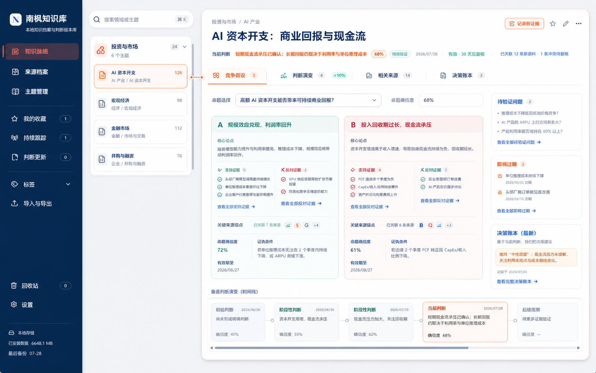
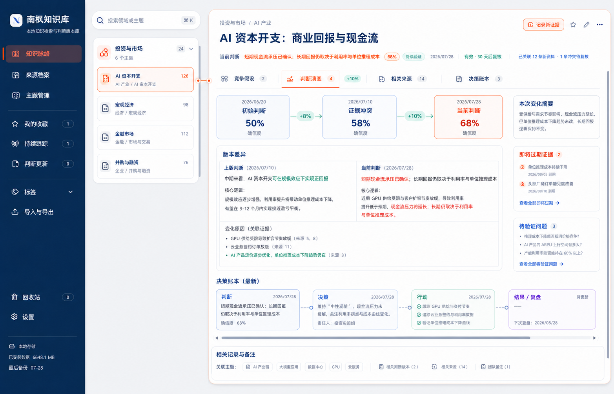
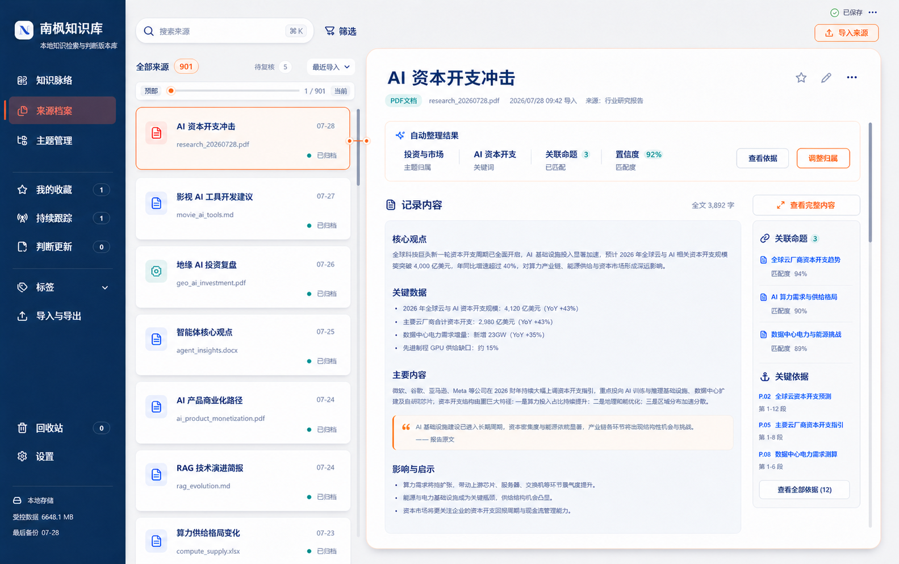
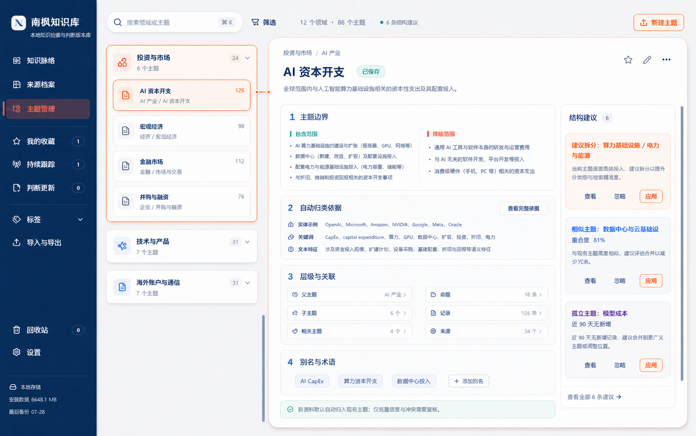

# 南枫知识库核心工作区设计基线

状态：`LOCKED`

确认日期：2026-07-29

本文件把南烛枫在会话中确认的四张最终页面图转成可执行合同。它锁定的是核心产品组织、页面功能布局和交互状态；五套皮肤是另一个独立视觉合同。除非南烛枫明确提出新方向，后续开发必须同时继承二者。

## 1. 确认对象分类

| 类别 | 本次状态 | 锁定内容 |
|---|---|---|
| A 产品与信息架构 | 已锁定 | 三个主入口；领域→主题→命题/竞争假设；来源、证据、判断、决策围绕命题组织 |
| B 页面功能布局 | 已锁定 | 四张最终页面图的栏位比例、模块组合、信息主次和默认模块 |
| C 交互与状态 | 已锁定 | 竞争假设默认、判断演变切换、独立滚动、时间线横向滚动、详情与选中项关联 |
| D 视觉皮肤 | 由既有五套皮肤合同独立锁定 | 页面布局不能替代或重写五套皮肤；皮肤也不能改变本文件的功能布局 |
| E 示例内容与数据语义 | 未锁定 | 图中的主题名称、数量、日期、百分比和示例文案仅用于表达结构，不是固定生产数据 |
| F 验收证据 | 设计已确认，正式 UI 未完成验收 | 预览确认不等于代码已集成、构建通过或 BAT 真实路径通过 |

## 2. 最终参考资产

统一规则：图片原件必须保留，不用聊天临时路径作为长期引用。

| 基准 ID | 文件 | SHA-256 | 锁定用途 |
|---|---|---|---|
| NF-CORE-KNOWLEDGE-HYP-01 | `screenshots/final-core-workspace/knowledge-view-competing-hypotheses.png` | `DD4232FB80D8261B62241ECB46C1D423FA11C2CC1C57696E0D08B949BC77F04E` | 知识视图默认“竞争假设”状态 |
| NF-CORE-KNOWLEDGE-EVO-01 | `screenshots/final-core-workspace/knowledge-view-judgment-evolution.png` | `906B6F6AACEB2668B3F6B87690AFEC31078E399CB09ED9824BBCB8379771E594` | 知识视图“判断演变”状态 |
| NF-CORE-SOURCE-01 | `screenshots/final-core-workspace/source-archive-final-layout.png` | `5CB176569518CBB06D05F5109C9D16F6B50CAD4984E35F36AAE22B85B004D158` | 来源档案最终功能布局 |
| NF-CORE-TOPIC-01 | `screenshots/final-core-workspace/topic-structure-final-layout.png` | `9D7AC64C97009BD2CD514CA57CE728D1CD7B6FD6F7B15ED983C971A15C6F8EAD` | 主题结构最终功能布局 |

### 知识视图：竞争假设

### 知识视图：判断演变

### 来源档案

### 主题结构

## 3. 跨页面不可丢失合同

1. 左侧全高主导航承担入口和状态，不被底部时间线或右侧详情侵占。
2. 中间栏保持较窄，只承担领域/主题树或来源列表；把主要阅读空间让给右侧详情。
3. 中栏选中项与右侧详情使用细橙色关联线和双锚点，线条位置随选中项真实几何对齐。
4. 中栏和右侧详情各自独立滚动；页面标题、模块导航和右侧卡片不能因左侧列表滚动而整体漂移。
5. 纵向内容不够时使用各自滚动条；判断/决策时间线不够时使用底部横向滚动条，不压缩成不可读卡片。
6. 自动整理结果优先呈现，人工修正是次级入口；不能把用户重新拖回逐条分类的主流程。
7. 五套皮肤只改变背景、玻璃、颜色和材质，不改变入口、对象层级、模块位置、默认状态和滚动合同。

## 4. 页面合同

### 4.1 来源档案

- 左：搜索、筛选、状态和来源列表；已归档/待复核状态清晰。
- 右上：来源标题、文件/平台元数据、收藏与更多操作。
- 右侧首屏优先显示“自动整理结果”：领域/主题、关联命题、置信度和调整归属入口。
- 主体显示统一格式的记录内容；右侧窄栏显示关联命题与关键依据。
- 自动分类是默认成果；只有低置信、冲突或缺少主题时突出人工修正。
- 默认不显示无正文空会话，但不删除原始来源。

### 4.2 主题结构

- 左：领域→主题树，支持搜索和筛选；编辑、新建与高级维护是次级操作。
- 右：主题标题、描述和保存状态。
- 主体固定覆盖：主题边界、自动归类依据、层级与关联、别名与术语。
- 右侧窄栏显示结构建议，可查看、忽略或应用；建议不能自动改写结构。
- 页面目标是维护分类结构，不与知识视图争夺判断、证据和决策阅读职责。

### 4.3 知识视图

- 默认进入“竞争假设”，同时提供“判断演变 / 相关来源 / 决策版本”切换。
- 左中栏按领域→主题浏览；右侧以命题为中心阅读成果。
- “竞争假设”并列展示多个假设，每个假设维护支持证据、反对证据、来源锚点、置信度、有效期和证伪条件。
- 右侧窄栏显示待验证问题、即将过期事实和最新决策版本。
- 底部时间线展示判断变化；空间不足时横向滚动。
- “判断演变”展示多个时间点、置信度变化、版本差异、变化原因和关联证据。
- 决策账本按“判断→决策→行动→结果/复盘”维护，历史版本不可被当前结论覆盖。

## 5. 明确排除

- 旧收录箱、旧整理工作台和旧主题浏览器作为并列主入口。
- 以大段新建/编辑表单作为知识视图首屏。
- 以现有 CRUD 存在、migration 通过或皮肤完成代替四张页面的 UI 集成。
- 只实现截图里的几个示例主题，或把示例数字写死进生产代码。
- 因换皮肤而移动模块、改变默认 Tab、删除竞争假设/判断演变之一。
- 以旧原型或 `docs/screenshots/reference-final-direction.png` 覆盖本文件的四张最终功能布局图。

## 6. 变更协议

南烛枫提出新方向时，必须记录：

1. 新方向属于 A–F 哪一类；
2. 替代哪个基准 ID 或哪条合同；
3. 哪些既有类别继续有效；
4. 新参考资产、视口、状态和验收条件。

没有明确替代关系时，本文件继续有效。
