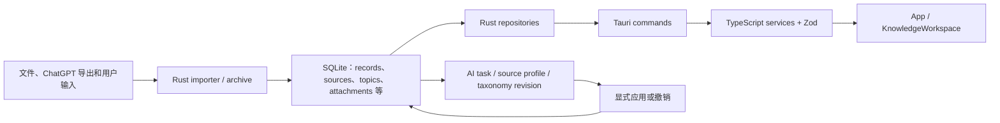

# 南枫知识库完整开发档案

> 复盘基线：2026-08-14。本文是基于代码、配置、测试输出、Git 历史和已有项目文档形成的静态档案；不替代动态交接文件 `docs/CURRENT_HANDOFF.md`，也不表示已重新执行所有历史验收。

## 1. 项目定位与证据范围

南枫知识库（仓库：`nanzhufeng/NanfengKnowledgeBase-Windows`）是一个 Windows 本地优先的知识整理桌面应用。当前代码以记录、来源、主题、洞察、导入、附件和受治理 AI 处理为核心对象；对外 AI 调用可配置，但正式数据持久化仍由本机 SQLite 承担。

本次复盘覆盖 `HEAD cc56a3d13375eeb9a7d4e772de1a59388a66e050`（分支 `codex/nanfeng-ai-automation-mvp-20260810`）的 585 个已跟踪文件、64 个提交、配置、前后端测试与文档；工作树仍含本轮尚未提交成果。Git 标签显示的发布节点为 `v0.1`（2026-07-26）、`v0.2`（2026-08-02）、`v0.3`（2026-08-10）和 `v0.4`（2026-08-13）。

已做的只读质量扫描覆盖 259 个文本文件、约 101,010 行：未发现合并冲突标记、`TODO/FIXME` 待办标记或明显明文密钥模式。该结果不等同于安全审计，也不能证明二进制资产或运行时配置绝无敏感信息。

## 2. 目标与产品边界

代码和 `README.md`、`docs/product-brief.md` 共同表明，项目的目标是把散落素材、导入内容与既有记录沉淀为可检索、可追溯、可维护的知识工作区；AI 用于辅助归档、分类、主题与洞察，而不是取代来源或静默改写用户判断。

已确认的边界：

- 本地优先：默认数据路径为 `D:\南枫知识库`，代码提供路径回退和迁移完整性检查。
- Windows 为当前正式交付平台；Tauri 配置产出 NSIS 安装包，发布说明应标注未签名边界。
- 来源、附件、导入记录和 AI 派生结果不是同一对象；AI 结果需要可应用、可撤销和可追踪。
- API 密钥由 Rust 的系统凭据库路径管理，设计上不写入 SQLite、日志或前端状态。

## 3. 架构、技术栈与目录

### 技术栈

| 层级 | 当前实现与依据 |
| --- | --- |
| 桌面壳 | Tauri 2，`src-tauri/tauri.conf.json` |
| 前端 | React 19、TypeScript 严格模式、Vite 6，`package.json`、`tsconfig.json` |
| 后端 | Rust 2021；最低 Rust 版本 1.77，`src-tauri/Cargo.toml` |
| 数据 | SQLite（`rusqlite` bundled、外键、WAL），包含 FTS5 使用路径，`src-tauri/src/database.rs` |
| 前端校验 | Zod 服务层封装，`src/services/knowledgeRepository.ts` |
| 测试 | Vitest、Playwright、Rust `cargo test`，相应配置和 `tests/`、`src/**/*.test.*` |
| 发布 | Tauri NSIS；Git tag、GitHub Release、安装包 SHA-256 作为发布证据链 |

### 目录职责

| 目录/文件 | 职责 |
| --- | --- |
| `src/` | React 页面、工作区、主题、服务层及 Vitest 用例 |
| `src/services/` | Tauri `invoke` 封装、Zod 校验、前端领域接口 |
| `src/theme/knowledgeSkins.ts` | 五套皮肤和浅/深色模式定义、旧 key 迁移 |
| `src-tauri/src/` | Tauri 命令、SQLite、导入、附件、AI、知识仓储 |
| `src-tauri/migrations/` | 发布后不可改写的前向 SQLite migration（当前至 0015） |
| `tests/` | Playwright 端到端用例 |
| `worker/` | 与构建、导入/处理相关的辅助资源；不是当前本地生产分类器的证据 |
| `docs/` | 架构、领域、设计、验收、发布、交接和历史文档 |
| `scripts/` | 验收、数据检查、发布辅助脚本 |

### 组件关系与数据流

`src-tauri/src/lib.rs` 汇集数据库、知识、导入、附件、AI 和命令模块；`src-tauri/src/commands.rs` 是较宽的桌面 IPC 入口。前端以 `App.tsx` 加载工作区，`KnowledgeWorkspace.tsx` 承担主要交互，`knowledgeRepository.ts` 管理带校验的领域调用，`recordRepository.ts` 保留兼容路径。

### 核心模块

| 模块 | 主要职责 | 关键边界 |
| --- | --- | --- |
| 数据库与路径 | migration 执行、外键/WAL、数据目录与复制校验 | 不改写已发布 migration；正式迁移前需预检与备份 |
| 知识仓储 | 记录、来源、主题、洞察等读写与查询 | Rust `knowledge/repository.rs` 是高复杂度核心文件 |
| 导入与附件 | 文件/导出解析、归档、重复与附件关联 | 保留来源链与取消、失败语义 |
| AI 管线 | 凭据、模型路由、任务、taxonomy、应用/撤销 | 路由冻结；派生结果不可静默覆盖原始数据 |
| Prompt Cache | 提示阶段的规范化、稳定摘要、命中与成本/用量账本 | 缓存键不得含原始正文或密钥；契约变化应隔离失效 |
| 工作区与皮肤 | 知识浏览、编辑、AI 操作和主题外观 | 皮肤不改变信息架构与业务职责 |

## 4. 关键设计决策及原因

1. **本地 SQLite 而非远端主库。** 数据库模块启用外键和 WAL，路径模块承担数据目录迁移与完整性检查；这符合离线可用、素材本地保存和可控数据边界。
2. **跨层以仓储与服务层隔离。** Rust repository 不直接暴露为 UI 细节，TypeScript 服务层使用 Zod 收束 IPC 输入输出，降低页面绕过契约的风险。
3. **AI 作为受治理的派生管线。** `ai/` 中的 task、source profile、taxonomy revision、assignment、integration、checkpoint 等对象使模型输出可检查、应用和撤销，而非直接覆盖内容。
4. **任务创建时冻结模型路由。** 避免设置变化影响运行中任务，支持在结果、成本和质量评估中追溯使用过的供应商/模型。
5. **Prompt Cache 使用稳定摘要而非原文。** v0.4 对应提交将规范化输入、阶段、路由和提示词版本纳入隔离条件；既减少重复 AI 成本，也避免把正文与密钥写入缓存键。
6. **皮肤与功能分离。** 现行 `knowledgeSkins.ts` 支持雾蓝、鼠尾草、暖陶、花房、奔马五套皮肤和深浅模式，并处理旧 key；功能布局仍由工作区承担。

## 5. 开发过程与版本演进

| 阶段 | Git 记录显示的重点 | 留下的能力 |
| --- | --- | --- |
| 2026-07-25 至 v0.1 | 原型、本地桌面链路、基础数据与安装路径 | 可运行的 Windows 知识工作区雏形 |
| v0.1 后至 7 月末 | 项目更名、知识生产、分类、附件、NSIS、数据库演进 | 导入/附件/主题等领域模型与初期发布能力 |
| 2026-07-29 至 v0.2 | 工作区扩展、皮肤与设计基线 | 知识视图和外观体系收敛 |
| 2026-08-10 v0.3 | OpenRouter/DeepSeek AI 主题自动化 | 受治理 AI 任务与主题处理主链路 |
| 2026-08-13 v0.4 | Prompt Cache、工作区和验收更新 | 缓存命中、用量/成本证据及 v14→v15 迁移链 |
| 2026-08-14 v149 | 全库归属单条确定性降级与批量AI协作式暂停 | 正式只读断点证据表明`json_object`合法但Schema语义无效；单条改为编号选择后本地映射ID/key，主题管理与主题洞察均可保存进度后稍后继续 |
| 2026-08-14 v154–v156 | 调用记录、统一路由基准、密钥输入承托与模型目录精简 | 设置页从“切换三家平台”收敛为一个路由策略；调用证据只读复用阶段账本；保存的密钥不进入前端状态；手动目录只保留本知识库有明确用途的模型 |

历史提交能说明功能出现的顺序，但不能单独证明当前用户环境已完成每次验收；当前状态仍应以最新交接、实际数据库和可重复命令为准。

## 6. 踩坑、修复与工程性收获

| 现象/风险 | 根因或背景 | 已采用的处理 | 证据边界 |
| --- | --- | --- | --- |
| 正式库升级风险 | SQLite schema 随功能增长演进 | 使用有序 migration、路径复制/完整性检查；当前交接记录 v14→v15 预检、备份和完整性通过 | 本次未再次操作正式库 |
| AI 成本与重复调用 | 相同阶段可能重复发送上下文 | v0.4 加入 Prompt Cache、用量/成本记录、稳定摘要和路由/阶段隔离 | 已有小批真实调用证据，不是全量质量证明 |
| AI 结果误覆盖知识 | 模型输出不等于用户事实 | 用 revision、integration、checkpoint、显式应用/撤销建模 | 需持续用真实工作流回归 |
| 文档多版本漂移 | 长周期迭代中旧方案未与当前代码同步 | 本档案建立冲突记录，长期规则与动态交接拆分 | 下列旧文档未在本次擅自改写 |
| 高复杂度文件维护风险 | 工作区、样式、仓储与命令持续集中 | 已识别热点，后续改动需沿链路做定向测试和小步拆分 | 是可维护性风险，非已证实缺陷 |
| AI 设置把通道误当成路由 | 三张 Key 卡原先容易被理解为三套独立模型策略 | v155 将路由收敛为唯一“自动规划 / 人工指定通道+模型”；Key 仅表示通道可用性，任务创建时冻结实际阶段模型 | 真实 WebView2 和一条真实新任务仍待验收 |
| 已存 Key 的呈现与输入框不协调 | 浏览器原生 input 尺寸与前端掩码呈现混用，且不能以展示掩码代替凭据边界 | v156 以视觉圆点掩码表示已保存状态；输入框恢复40px完整承托，眼睛嵌入右侧且仅在显式点击时读取系统凭据 | 未对真实 Key 做界面读取测试 |
| 手动模型目录噪声过多 | 动态目录按作者列“最新三条”不等于对知识库有路由价值 | Rust 在远端刷新和已存目录读取两端过滤：千问 Flash/Plus/Max、DeepSeek Flash/Pro、OpenRouter Terra/Sonnet；失效旧选择安全回退自动 | 目录内容随供应商可用性变化，真实刷新待验 |

当前热点包括 `src/styles.css`（约 14,885 行）、`knowledge/repository.rs`（约 7,562 行）、`KnowledgeWorkspace.tsx`（约 4,898 行）、`App.tsx`（约 4,436 行）和 `commands.rs`（约 2,231 行）。任何横跨这些文件的改动都应先界定领域契约，再做局部回归。

## 7. 测试、验证与发布

### 本次复盘中重新执行的验证

| 层级 | 命令/结果 | 结论 |
| --- | --- | --- |
| TypeScript | `npm.cmd run typecheck` 通过 | 静态类型通过 |
| 前端单元/组件 | `npm.cmd test`：37 个文件、220 个用例通过 | 当前 Vitest 契约通过 |
| 站点辅助测试 | `npm.cmd run test:sites`：4 个通过 | 该脚本覆盖范围通过 |
| Rust | `cargo test --manifest-path src-tauri/Cargo.toml --no-fail-fast`：150 通过、1 忽略 | 当前 Rust 测试通过；忽略项是 Explorer 真实环境相关用例 |
| Playwright | 全量 `knowledge-final-view.spec.ts` 被暗色皮肤的旧固定 RGB 断言拦截 | 期待 `rgb(12,16,17)`，实际是当前场景语义色；该旧断言未在本轮路由任务中修改，不能作为 v156 失败或通过证据 |

Cargo 测试产生或复用了被 `.gitignore` 忽略的 `src-tauri/target` 编译缓存。本次未清理它，避免删除可能仍被用户使用的构建产物；后续应按项目共享缓存规则盘点后再处理。

### 历史正式发布证据

Git 标签与已有发布记录表明 v0.4 已作为 Windows Release 交付；本次未重新构建、上传或安装，也未重新下载远端资产复验。因此本档案将其标为“已有发布历史”，不表述为本次重新完成的正式发布验收。Windows 安装包仍需向使用者明确未签名提示的边界。

## 8. 文档与代码冲突登记

| 文档 | 旧说法 | 当前代码/较新证据 | 处理与影响 |
| --- | --- | --- | --- |
| 根目录旧 `AGENTS.md` | 四套旧皮肤名称，且缺少深色模式事实 | `src/theme/knowledgeSkins.ts` 为五套皮肤（雾蓝、鼠尾草、暖陶、花房、奔马）并有浅/深模式、旧 key 迁移 | 本次已替换为长期规则，不把旧皮肤清单作为当前事实 |
| `docs/product-brief.md` | 仍含“未打开/升级”及旧记录数量表述 | 最新 `CURRENT_HANDOFF.md` 记录 v14→v15 正式库迁移通过，并给出不同当前统计 | 将产品简报视作阶段历史；正式库状态以最新交接与实际库检查为准 |
| `docs/platform-release.md` | 仍写 GitHub Release 未上传，且安装包命名旧 | Git 标签/已有发布记录已有 v0.4 历史，资产命名已演进 | 该文档需在下次发布维护时同步；本次不改旧发布叙述 |
| `docs/performance-architecture.md` | 将 `classification.worker.ts` 等描述为当前路径 | v0.4 当前代码已无该本地生产分类 worker；AI 路径位于 Rust `ai/` 模块 | 该文档只能作为历史性能方案，不能指导当前 AI 实现 |
| `docs/CURRENT_HANDOFF.md` | 同一文件混有最新段落与较早“当前结论” | 文件顶部最新日期段落更接近当前证据，较下方内容属历史接手材料 | 后续应将历史段落归档或显式标注，避免双重“当前”入口 |
| `docs/next-codex-prompt.md` | 曾把 v110 写为当前唯一任务与验收程序 | 当前交接顶部、v156构建元数据和根BAT均指向 `v156-key-field-and-model-curation` | 本次已改为 v156 的无费用界面验收步骤；旧 v110 合同只保留在历史段落中 |

冲突的解决原则是：当前代码与最新可重复验证优先，动态运行事实以最新交接和真实环境检查优先；旧文档保留历史价值但不得作为当前实施依据。

## 9. 已知问题、未确认项与后续路线

以下不是新承诺，而是从当前代码、交接和验证边界得到的待办方向：

1. **浏览器 E2E 未在本次复盘重跑。** 先确认 4174 占用进程的用途，再在独立端口或用户确认的环境完成 Playwright 验收。
2. **Prompt Cache 的质量外推不可成立。** 已有小批真实业务命中和费用证据；仍需要对 901 来源等较大范围分批执行、抽检语义一致性、观察回退和成本缺口，尤其是供应商不回传费用时。
3. **v149 单条编号降级尚未真实续跑。** 自动合同、生产构建和现有`893/893`档案、`240/893`归属断点兼容均已确认，但来源ID 241及后续全库结果仍须在v149中由用户点击继续后验证；不得把构建通过写成全库生成成功。
4. **真实桌面路径尚未重验。** v149验收EXE已经重建并校验，但未启动WebView2应用、执行安装/卸载或写正式数据库；这些应与单元测试和只读断点审计明确区分。
5. **文档治理仍需后续同步。** 冲突表中的旧文档还在仓库中，为避免无依据改写历史，旧证据继续保留但不得取得当前所有权。
6. **高复杂度热点需要渐进治理。** 不建议在没有行为契约和回归测试的情况下重写大文件；应优先从单一领域、稳定接口和重复 bug 入手拆分。
7. **跨平台与签名不是当前已验证能力。** Windows 是当前正式边界；macOS/notarization 与代码签名需在真实平台、证书和发布流程可用时单独验收。
8. **v156 的真实设置页与真实调用尚待确认。** 自动测试和唯一验收程序已生成并自校验，但本轮没有启动 WebView2、读取/写入正式资料库、读取真实 Key、刷新在线目录或发起会产生费用的 AI 请求。

## 10. 证据索引

- **代码与配置：** `package.json`、`tsconfig.json`、`vite.config.ts`、`playwright.config.ts`、`src-tauri/Cargo.toml`、`src-tauri/tauri.conf.json`、`src-tauri/src/lib.rs`、`src-tauri/src/database.rs`、`src-tauri/src/commands.rs`、`src-tauri/src/ai/`、`src/services/knowledgeRepository.ts`、`src/theme/knowledgeSkins.ts`。
- **测试：** `src/**/*.test.*`、`tests/*.spec.*`、本档案第 7 节的实际命令输出。
- **文档：** `README.md`、`docs/CURRENT_HANDOFF.md`、`docs/product-brief.md`、`docs/platform-release.md`、`docs/performance-architecture.md`、领域和设计基线文档。
- **Git：** `git log --all`、`git tag --list`、HEAD `cc56a3d13375eeb9a7d4e772de1a59388a66e050`。
- **本轮 AI 设置与交接：** `src/components/AiAutomationSettings.tsx`、`src/components/AiModelPicker.tsx`、`src-tauri/src/ai/models.rs`、`src-tauri/src/ai/client.rs`、`src-tauri/src/ai/repository.rs`、`docs/CURRENT_HANDOFF.md` 的 v154–v156 段、`docs/test-plan.md` 的 2026-08-14 v156 记录。
